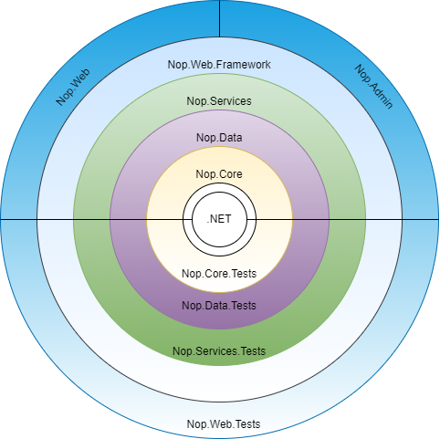

# CRITIQUE.md

---

## 1. Arquitectura do nopCommerce - O que Facilitou/ Dificultou a Instrumentação

O nopCommerce está estruturado numa arquitectura Onion de cinco camadas com uma regra de dependência estritamente unidireccional. Esta organização em camadas tem consequências directas e desiguais para a observabilidade. Esta organização em camadas tem consequências directas e desiguais para a observabilidade:

### O que facilitou

- **`EntityRepository<T>`** (`Nop.Data`): todos os INSERT, UPDATE e DELETE do sistema passam por esta única classe genérica. Instrumentar os seus três métodos (`InsertAsync`, `UpdateAsync`, `DeleteAsync`) uma única vez é suficiente para produzir spans a nível de base de dados em todos os serviços, sem modificar qualquer lógica de negócio;

- **`IEventPublisher`** (`Nop.Services/Events`): todos os eventos de domínio (`OrderPlacedEvent`, `OrderPaidEvent`, `ShoppingCartItemMovedToOrderItemEvent`) são despachados através de um único método `PublishAsync`, ou seja, apenas precisamos de um único ponto de instrumentação para regista a ocorrência e o timing de todos os eventos de domínio da aplicação;

- **Auto-instrumentação do ASP.NET Core**: o SDK OpenTelemetry para .NET fornece spans HTTP automáticos, cobrindo todos os pedidos recebidos com rota, método, código de estado e duração.

### O que dificultou

- **As operações de leitura ignoram completamente o `EntityRepository<T>`**;

- **Padrão Service Locator no `IEventPublisher`**: a implementação resolve os handlers de eventos em tempo de execução através de `EngineContext.Current.ResolveAll<IConsumer<T>>()`, contornando o contentor de injecção de dependências. Isto impede que o padrão Decorator seja aplicado via sem modificar as suas implementações;

- **Opacidade do sistema de plugins**: fornecedores de pagamento, calculadoras de envio e serviços de impostos são carregados como assemblies externos em tempo de execução. A sua lógica interna não gera spans.

---

## 2. Alterações Arquitecturais para Melhorar a Observabilidade

| Alteração | Impacto | Custo |
|---|---|---|
| Envolver `IStaticCacheManager` com um decorator instrumentado | Fecha a lacuna operacionalmente mais significativa: cache hits são actualmente indistinguíveis de queries rápidas nos traces; picos de invalidação de cache são invisíveis | Baixo — uma nova classe |
| Definir um contrato `ITelemetryProvider` para plugins, análogo a `IPaymentMethod` | Permite que a aplicação anfitriã recolha dados básicos de timing e resultado de qualquer plugin sem aceder ao seu código-fonte | Baixo em código, requer adoção como convenção em todos os plugins |
| Substituir o Service Locator no `IEventPublisher` por um pipeline mediator ao estilo MediatR | Permite spans por handler e middleware uniforme (observabilidade, retry, validação) em todos os eventos de domínio | Alto — todas as implementações de `IConsumer<T>` na base de código são alvos de migração;|

---

## 3. O Que Foi Necessário e Como o Impacto Foi Minimizado

Foram modificadas cinco classes:

| Classe | Camada | Alteração |
|---|---|---|
| `EntityRepository<T>` | `Nop.Data` | Span a envolver `InsertAsync`, `UpdateAsync`, `DeleteAsync` |
| `EventPublisher` | `Nop.Services/Events` | Span a envolver `PublishAsync` |
| `OrderProcessingService` | `Nop.Services/Orders` | Span + métricas a envolver `PlaceOrderAsync` |
| `PaymentService` | `Nop.Services/Payments` | Span + métricas a envolver `ProcessPaymentAsync` |
| `ProductService` | `Nop.Services/Catalog` | Span + métricas a envolver `AdjustInventoryAsync` |

Em todos os casos, a alteração seguiu o mesmo padrão: um span é aberto no início do método com `NopActivitySource.Source.StartActivity(...)`, são definidas tags no span, e a métrica é registada antes do método retornar.

A escolha do `EntityRepository<T>` como ponto de instrumentação primário de base de dados é arquitecturalmente motivada: situa-se na fronteira de infra-estrutura (`Nop.Data`), abaixo da camada de serviços. Instrumentar a este nível significa que uma única alteração produz spans para todos os serviços da aplicação. Instrumentar ao nível dos serviços  (`InsertOrderAsync`, `InsertProductAsync`, ...) exigiria modificar centenas de métodos.
