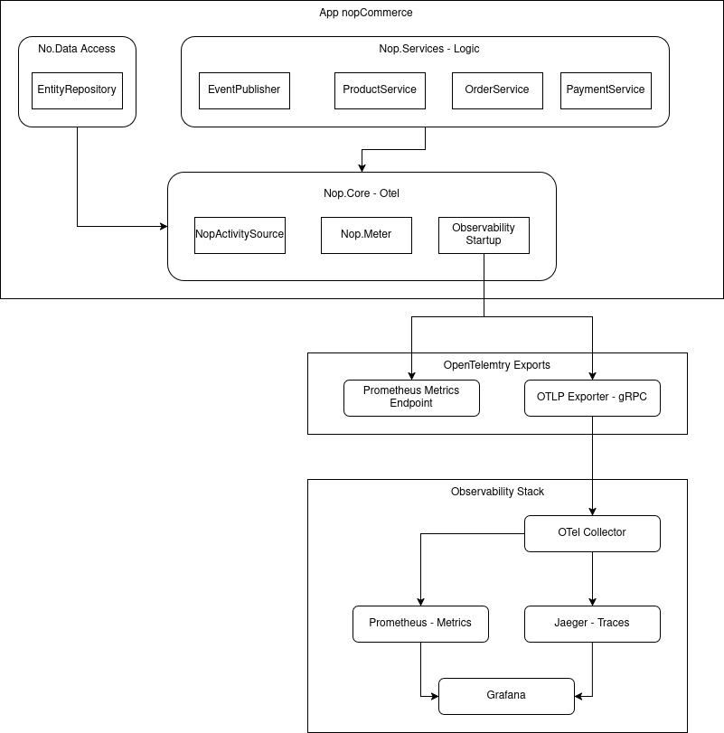

# AS — Individual Project

| | |
|---|---|
| **Cadeira** | Arquitetura de Software |
| **Aluno** | Duarte Rainho dos Santos |
| **Número Mecanográfico** | 113304 |
| **Assignment** | Assignment 1 |
| **Data de entrega** | 2026-03-24 |

---

## Sobre o projecto

Este projecto consiste na instrumentação de observabilidade de uma aplicação e-commerce open-source, **nopCommerce**, utilizando **OpenTelemetry**.

O objectivo é adicionar traces, métricas e logs distribuídos ao fluxo de checkout, tornando o sistema observável através de uma stack de ferramentas standard: **OTel Collector**, **Jaeger**, **Prometheus** e **Grafana**.

---

## Arquitectura de Instrumentação

---

## Documentação

### Geral

| Documento | Descrição |
|---|---|
| [Como correr](docs/Running.md) | Guia passo a passo para arrancar o projecto |
| [Arquitectura](./docs/Architecture-Analysis/Architecture.md) | Camadas, regras de dependência e comunicação |
| [IEventPublisher](./docs/Architecture-Analysis/IEventPublisher.md) | Sistema de eventos in-process do nopCommerce |
| [Observabilidade — Fácil vs Difícil](./docs/Architecture-Analysis/Observability-Easy-vs-Hard.md) | Onde a instrumentação é natural e onde é problemática |
| [Mudanças Estruturais](./docs/Architecture-Analysis/Structural-Changes.md) | O que falta instrumentar e se vale a pena mudar |

### Observabilidade por Serviço

| Documento | Descrição |
|---|---|
| [Order](./docs/Observability/Services/Order.md) | Spans, métricas e casos de uso do fluxo de encomenda |
| [Payment](./docs/Observability/Services/Payment.md) | Spans, métricas e casos de uso do processamento de pagamento |
| [Basket](./docs/Observability/Services/Basket.md) | Spans, métricas e casos de uso do carrinho de compras |
| [Inventory](./docs/Observability/Services/Inventory.md) | Spans, métricas e casos de uso da gestão de stock |
| [Protecção de PII](./docs/Observability/PII_protection.md) | Estratégia de redacção de dados pessoais nos traces |

### Testes de Carga

| Documento | Descrição |
|---|---|
| [Visão Geral](./docs/load-tests/main.md) | Introdução e estrutura dos testes de carga |
| [Smoke Tests](./docs/load-tests/smoke-tests.md) | Testes de validação mínima do sistema |
| [Load Tests](./docs/load-tests/Load-tests.md) | Cenários de carga e resultados |

