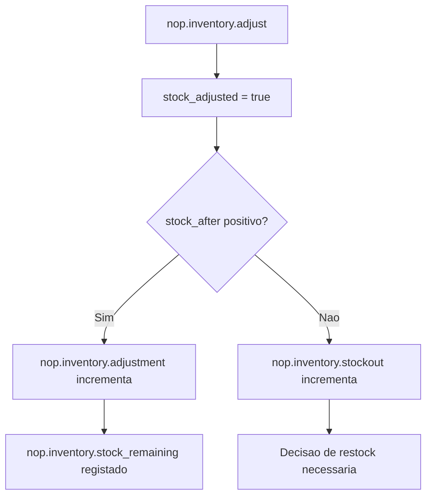
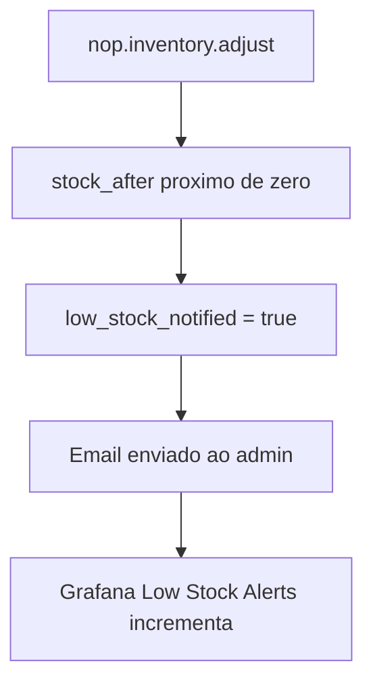
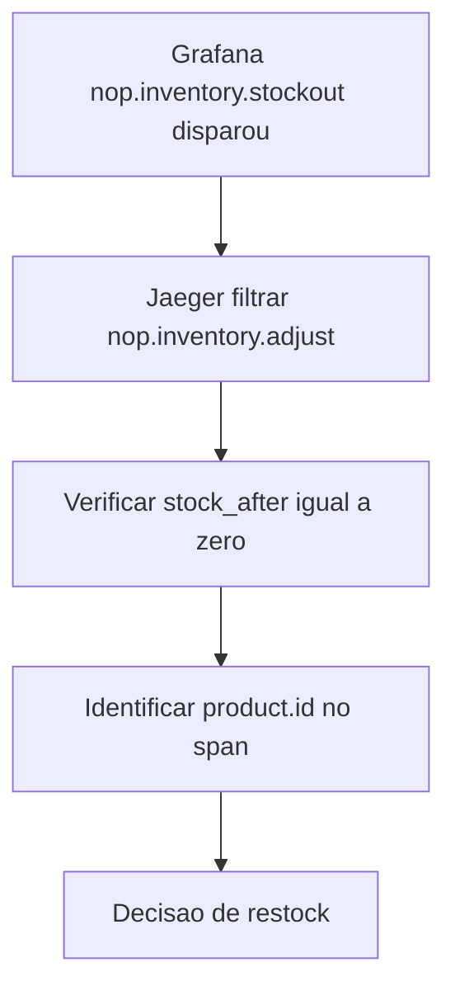
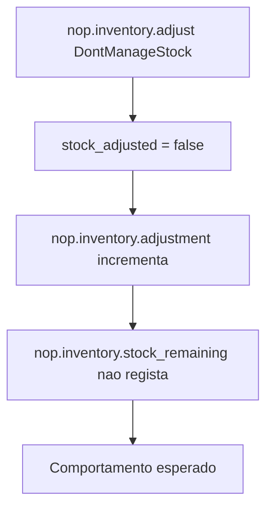
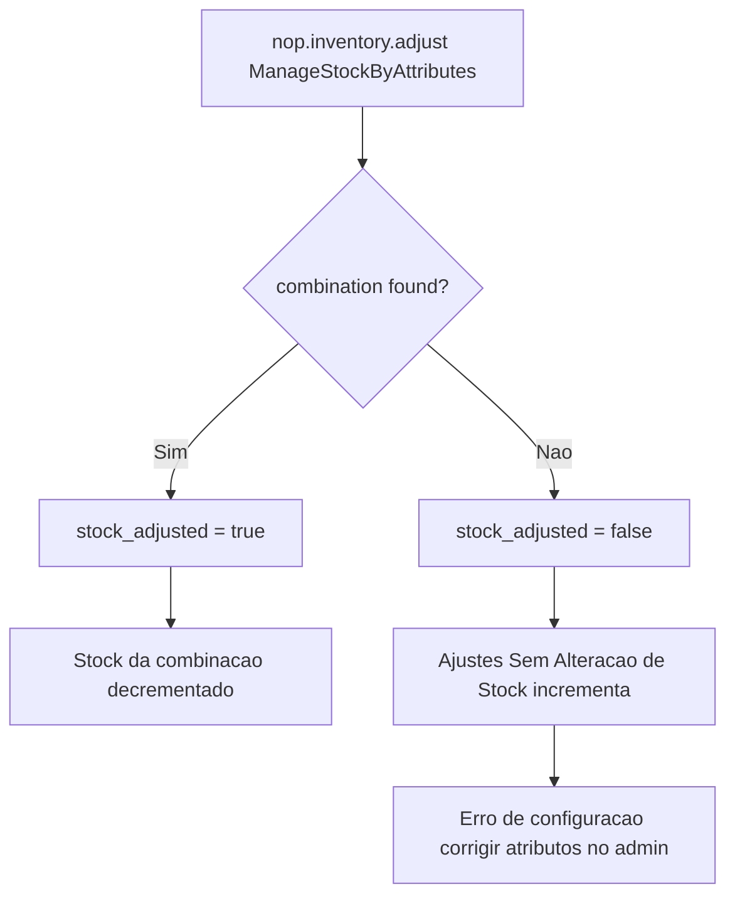

# Observabilidade de Inventário

## 1. Contexto

> Onde o Inventário se Situa no Fluxo de Checkout (Imporate perceber para saber como aplciar telemetria)

O ajuste de inventário acontece dentro do pipeline de checkout de encomendas. Quando um cliente completa o checkout, a cadeia de chamadas é:

```
HTTP POST /checkout/confirm
  └─ CheckoutController.ConfirmOrder()
       └─ OrderProcessingService.PlaceOrderAsync()          [span: nop.order.place]
            └─ MoveShoppingCartItemsToOrderItemsAsync()
                 └─ ProductService.AdjustInventoryAsync()   [span: nop.inventory.adjust]
```

`AdjustInventoryAsync` é a **Importante** para o inventário: é o único ponto de entrada que decrementa stock independentemente do modo de gestão de inventário em uso (este 3 formas que serão abordadas mais à frente). Instrumentar aqui fornece um span de trace e duas métricas que cobrem todos os caminhos de inventário sem duplicar instrumentação em helpers de nível inferior.

---

## 2. Os Três Modos de Gestão de Inventário

O nopCommerce suporta três modos, configurados por produto no painel admin em **Catálogo -> Produtos -> Inventário**:

| Modo | Como o stock é rastreado | Quando `stockAdjusted` é `true` |
|---|---|---|
| `ManageStock` | Integer único `Product.StockQuantity` (ou por armazém via `ProductWarehouseInventory`) | Sempre — o stock é sempre decrementado/incrementado |
| `ManageStockByAttributes` | Por `ProductAttributeCombination.StockQuantity` (ex. S/M/L × Azul/Vermelho) | Apenas quando a combinação correspondente é encontrada |
| `DontManageStock` | Sem rastreamento de stock (downloads digitais, gift cards, serviços) | Nunca |

---

## 3. Ficheiros Modificados

### `src/Libraries/Nop.Core/Observability/NopMeter.cs`

Define três instrumentos usados pelo subsistema de inventário:

```csharp
public static readonly Counter<long> InventoryAdjustment =
    _meter.CreateCounter<long>("nop.inventory.adjustment", unit: "{adjustment}", ...);

public static readonly Histogram<long> StockRemaining =
    _meter.CreateHistogram<long>("nop.inventory.stock_remaining", unit: "{unit}", ...);

public static readonly Counter<long> StockOut =
    _meter.CreateCounter<long>("nop.inventory.stockout", unit: "{event}", ...);
```

### `src/Libraries/Nop.Services/Catalog/ProductService.cs` — `AdjustInventoryAsync`

O método rastreia um booleano `stockAdjusted` que começa a `false` e é definido como `true` apenas nos dois caminhos onde o stock é efectivamente modificado:

```csharp
public virtual async Task AdjustInventoryAsync(Product product, int quantityToChange, ...)
{
    var lowStockNotified = false;
    var stockAdjusted = false;   // rastreia se o stock foi efectivamente alterado
    long? stockAfter = null;

    using var span = NopActivitySource.Source.StartActivity("nop.inventory.adjust", ActivityKind.Internal);
    span?.SetTag("product.id", product.Id);
    span?.SetTag("inventory.quantity_change", quantityToChange);
    span?.SetTag("inventory.method", product.ManageInventoryMethod.ToString());

    try
    {
        if (product.ManageInventoryMethod == ManageInventoryMethod.ManageStock)
        {
            span?.SetTag("inventory.multi_warehouse", product.UseMultipleWarehouses);
            // ... lógica de armazém ...
            var totalStock = await GetTotalStockQuantityAsync(product);
            stockAfter = totalStock;
            stockAdjusted = true;   // stock foi decrementado
            // ... notificação de stock baixo ...
        }

        if (product.ManageInventoryMethod == ManageInventoryMethod.ManageStockByAttributes)
        {
            var combination = await _productAttributeParser.FindProductAttributeCombinationAsync(product, attributesXml);
            span?.SetTag("inventory.combination_found", combination != null);

            if (combination != null)
            {
                combination.StockQuantity += quantityToChange;
                await _productAttributeService.UpdateProductAttributeCombinationAsync(combination);
                stockAfter = combination.StockQuantity;
                stockAdjusted = true;   // combinação encontrada — stock foi decrementado
                // ... notificação de stock baixo ...
            }
            // se combination == null: stockAdjusted permanece false
        }

        // DontManageStock: stockAdjusted permanece false

        // produtos em bundle (chamada recursiva para produtos associados)
        // ...

        // emitir tags e métricas
        if (stockAfter.HasValue)
            span?.SetTag("inventory.stock_after", stockAfter.Value);
        span?.SetTag("inventory.low_stock_notified", lowStockNotified.ToString().ToLower());
        span?.SetTag("inventory.stock_adjusted", stockAdjusted);

        NopMeter.InventoryAdjustment.Add(1,
            new KeyValuePair<string, object>("inventory.method", product.ManageInventoryMethod.ToString()),
            new KeyValuePair<string, object>("inventory.low_stock_notified", lowStockNotified.ToString().ToLower()),
            new KeyValuePair<string, object>("inventory.stock_adjusted", stockAdjusted.ToString().ToLower()));

        if (stockAfter.HasValue)
        {
            NopMeter.StockRemaining.Record(stockAfter.Value,
                new KeyValuePair<string, object>("inventory.method", product.ManageInventoryMethod.ToString()));

            if (stockAfter.Value <= 0)
                NopMeter.StockOut.Add(1,
                    new KeyValuePair<string, object>("inventory.method", product.ManageInventoryMethod.ToString()));
        }
    }
    catch (Exception ex)
    {
        span?.SetStatus(ActivityStatusCode.Error, ex.Message);
        throw;
    }
}
```

---

## 4. Referência de Spans e Métricas

### Span: `nop.inventory.adjust`

| Tag | Tipo | Valores |
|---|---|---|
| `product.id` | int | ID do produto na base de dados |
| `inventory.method` | string | `ManageStock` / `ManageStockByAttributes` / `DontManageStock` |
| `inventory.quantity_change` | int | Negativo para deduções (ex. `-1`), positivo para devoluções |
| `inventory.stock_after` | long | Stock restante após ajuste (ausente para `DontManageStock` e combinação-não-encontrada) |
| `inventory.low_stock_notified` | bool | `true` se email ao admin foi enviado |
| `inventory.stock_adjusted` | bool | `true` se o stock foi efectivamente alterado; `false` para `DontManageStock` ou combinação em falta |
| `inventory.multi_warehouse` | bool | `true` se o produto usa multi-armazém (apenas quando `ManageStock`) |
| `inventory.combination_found` | bool | Se a combinação de atributos correspondeu (apenas quando `ManageStockByAttributes`) |

### Métricas

| Métrica | Nome Prometheus | Tipo | Tags |
|---|---|---|---|
| `nop.inventory.adjustment` | `nopcommerce_nop_inventory_adjustment_total` | Counter | `inventory_method`, `inventory_low_stock_notified`, `inventory_stock_adjusted` |
| `nop.inventory.stock_remaining` | `nopcommerce_nop_inventory_stock_remaining` | Histogram | `inventory_method` |
| `nop.inventory.stockout` | `nopcommerce_nop_inventory_stockout_total` | Counter | `inventory_method` |

---

## 6. Painéis do Dashboard Grafana

O dashboard Grafana (`nopcommerce-inventory`) contém cinco painéis relacionados com inventário:

| Painel | Tipo | O que mostra |
|---|---|---|
| Ajustes de Inventário por Método | Timeseries | Taxa de ajustes por segundo, dividida por `inventory_method` |
| Alertas de Stock Baixo Disparados | Stat | Total de ajustes que dispararam uma notificação de stock baixo |
| Stock Restante p50/p95/p99 | Timeseries | Distribuição de stock restante após cada venda |
| Ajustes Sem Alteração de Stock | Stat | Total de ajustes onde `inventory_stock_adjusted=false` |
| Rupturas de Stock | Stat | Total de vezes que o stock atingiu zero |

---
## 7. Casos de Uso core

Aplicar este tipo de telemetria no service Inventory pode vir a ser útil para: 

- Fazer a gestão de **Checkout normal** (ManageStock);
- Verificar quando o stock está baixo (para nunca chegar a stock 0);
- Uma rutura de stock;
- DontManageStock (produto digital):
  - **Esperado**: span com `inventory.method=DontManageStock`, `inventory.stock_adjusted=false`. Sem observação no histograma (não há quantidade de stock a rastrear).
  - **Esperado no Grafana**: counter `nop.inventory.adjustment` incrementa mas histograma `nop.inventory.stock_remaining` não.
- ManageStockByAttributes (combinação encontrada):
  - **Esperado**: span com `inventory.combination_found=true`, `inventory.stock_adjusted=true`, `inventory.stock_after=4`.
- ManageStockByAttributes (combinação NÃO encontrada) - produto com combinações de atributos mas artigo do carrinho com atributos não correspondentes (ex. atributos foram eliminados após a encomenda ser colocada, ou problema de integridade de dados):
  - **Esperado**: span com `inventory.combination_found=false`, `inventory.stock_adjusted=false`.
  - **Esperado no Grafana**: painel “Ajustes Sem Alteração de Stock” incrementa. Um valor não-zero aqui em produção sinaliza um erro de configuração de produto que requer investigação.

---

## 8. Fluxogramas de Investigação

### Caso 1 — Checkout Normal (ManageStock)



### Caso 2 — Stock Baixo



### Caso 3 — Rutura de Stock



### Caso 4 — DontManageStock



### Caso 5 — ManageStockByAttributes


