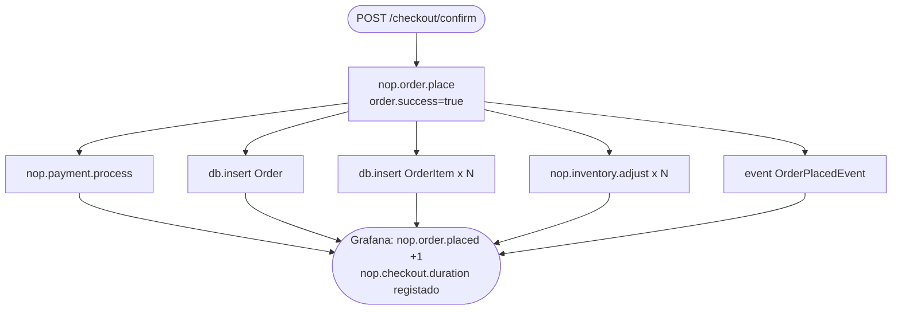
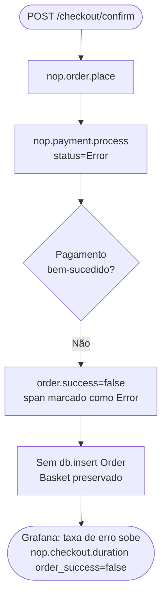
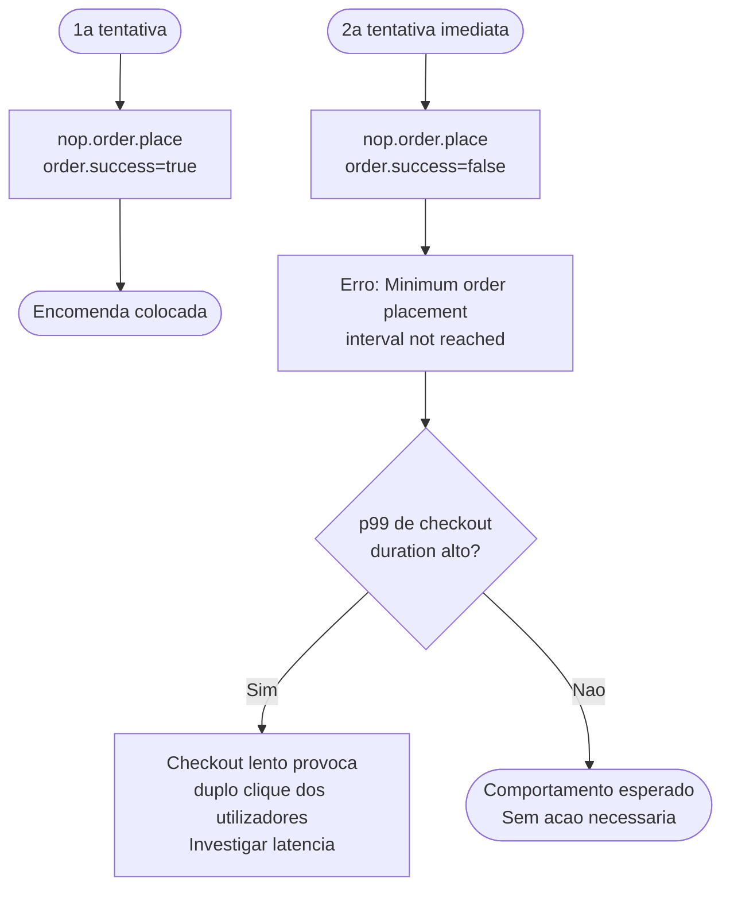
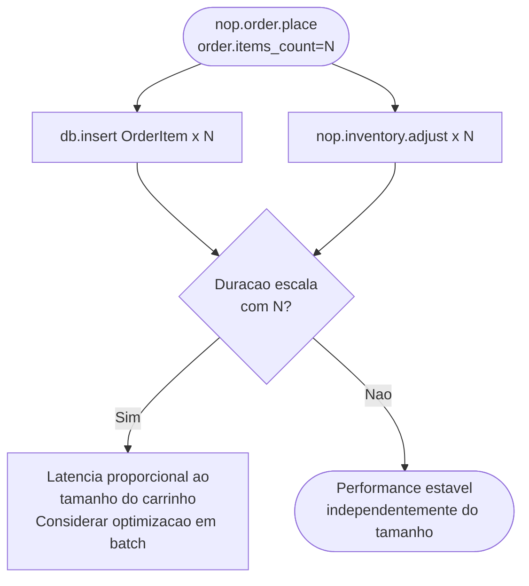
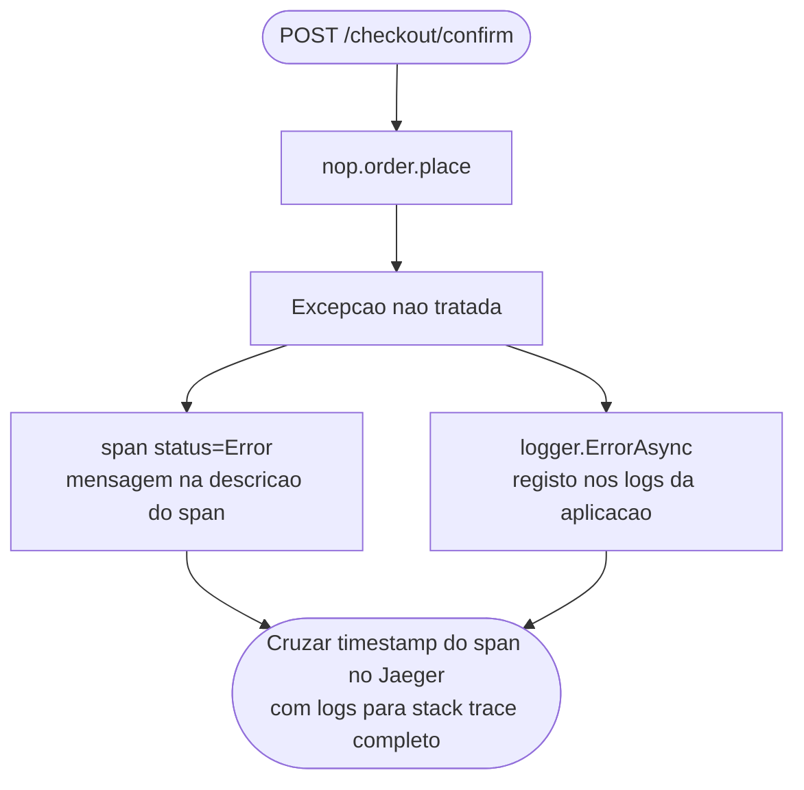

# Observabilidade de Encomendas

## 1. Contexto 

> Onde a Encomenda se Situa no Fluxo de Checkout (importante);

O processamento de encomendas é a operação central do fluxo de checkout, no fundo faz a orquestração do pagamento, a persistência, o ajuste de inventário e as notificações pós-encomenda. A cadeia de chamadas é:

```
HTTP POST /checkout/confirm
  └─ CheckoutController.ConfirmOrder()
       └─ OrderProcessingService.PlaceOrderAsync()      [span: nop.order.place]
            ├─ PreparePlaceOrderDetailsAsync()           [fora do span — apenas validação]
            ├─ GetProcessPaymentResultAsync()
            │    └─ PaymentService.ProcessPaymentAsync() [span: nop.payment.process]
            ├─ SaveOrderDetailsAsync()
            │    └─ EntityRepository.InsertAsync()       [span: db.insert Order]
            ├─ MoveShoppingCartItemsToOrderItemsAsync()
            │    └─ EntityRepository.InsertAsync()       [span: db.insert OrderItem] (× N itens)
            │    └─ ProductService.AdjustInventoryAsync() [span: nop.inventory.adjust] (× N itens)
            ├─ SaveDiscountUsageHistoryAsync()
            ├─ SaveGiftCardUsageHistoryAsync()
            ├─ SendNotificationsAndSaveNotesAsync()
            └─ EventPublisher.PublishAsync(OrderPlacedEvent) [span: event OrderPlacedEvent]
```

> **Nota de âmbito importante:** `PreparePlaceOrderDetailsAsync` (validação do carrinho, cálculo de totais, verificação de cupões) corre *antes* do span ser iniciado. Falhas antecipadas aqui — como um carrinho vazio ou um método de pagamento inválido — não são capturadas por `nop.order.place`. Este é um trade-off intencional: essas validações são lógica de negócio pura, e a fronteira de instrumentação é mantida no ponto onde o trabalho efectivo começa.

---

## 2. Os Dois Caminhos de Execução

O nopCommerce suporta dois modos para colocação de encomendas, controlados por `_orderSettings.PlaceOrderWithLock`:

| Modo | Descrição | Quando usado |
|---|---|---|
| `PlaceOrderWithLock = false` | Chamada assíncrona directa a `placeOrder()` | Por defeito — sem protecção de concorrência |
| `PlaceOrderWithLock = true` | Envolve `placeOrder()` num `Mutex` nomeado por cliente, com rate limit baseado em cache | Quando `MinimumOrderPlacementInterval` está configurado para prevenir encomendas duplicadas |

Ambos os caminhos são cobertos pelo mesmo span — o tempo de espera do mutex está incluído em `nop.checkout.duration`, o que significa que alta contenção de lock (múltiplos checkouts concorrentes pelo mesmo cliente) é visível como picos de latência no histograma.

---

## 3. Ficheiros Modificados

### `src/Libraries/Nop.Core/Observability/NopMeter.cs`

Define dois instrumentos usados pelo subsistema de encomendas:

```csharp
// Regista a duração end-to-end de PlaceOrderAsync, por método de pagamento e resultado.
public static readonly Histogram<double> CheckoutDuration =
    _meter.CreateHistogram<double>("nop.checkout.duration", unit: "ms", ...);

// Conta tentativas de colocação de encomendas, por método de pagamento e resultado.
// Counter explícito para painéis "encomendas por minuto" e "taxa de falha de encomendas".
public static readonly Counter<long> OrderPlaced =
    _meter.CreateCounter<long>("nop.order.placed", unit: "{order}", ...);
```

### `src/Libraries/Nop.Services/Orders/OrderProcessingService.cs` — `PlaceOrderAsync`

```csharp
public virtual async Task<PlaceOrderResult> PlaceOrderAsync(ProcessPaymentRequest processPaymentRequest)
{
    // ... validação de argumentos e PreparePlaceOrderDetailsAsync() — fora do span ...

    var paymentMethodName = processPaymentRequest.PaymentMethodSystemName;
    var sw = Stopwatch.StartNew();

    using var span = NopActivitySource.Source.StartActivity("nop.order.place", ActivityKind.Internal);
    span?.SetTag("payment.method", paymentMethodName);

    PlaceOrderResult finalResult;

    // ... lógica PlaceOrderWithLock chama placeOrder(details) ...

    sw.Stop();
    var orderSuccess = finalResult.Success.ToString().ToLower();
    span?.SetTag("order.success", orderSuccess);
    span?.SetTag("order.items_count", details.Cart.Count);
    if (finalResult.PlacedOrder != null)
        span?.SetTag("order.id", finalResult.PlacedOrder.Id);
    if (!finalResult.Success)
        span?.SetStatus(ActivityStatusCode.Error, string.Join("; ", finalResult.Errors));

    NopMeter.CheckoutDuration.Record(sw.Elapsed.TotalMilliseconds,
        new KeyValuePair<string, object>("payment.method", paymentMethodName),
        new KeyValuePair<string, object>("order.success", orderSuccess));

    NopMeter.OrderPlaced.Add(1,
        new KeyValuePair<string, object>("payment.method", paymentMethodName),
        new KeyValuePair<string, object>("order.success", orderSuccess));

    return finalResult;
}
```

---

## 4. Referência de Spans e Métricas

### Span: `nop.order.place`

| Tag | Tipo | Quando é definida | Valores |
|---|---|---|---|
| `payment.method` | string | início do span | ex. `"Payments.CheckMoneyOrder"`, `"Payments.Manual"` |
| `order.success` | string | fim do span | `"true"` / `"false"` |
| `order.id` | int | fim do span (apenas sucesso) | ID da encomenda na base de dados |
| `order.items_count` | int | fim do span | Número de linhas de artigo na encomenda |

Quando `order.success = "false"`, o estado do span é definido como `Error` com as mensagens de erro concatenadas.

### Métricas

| Métrica | Nome Prometheus | Tipo | Tags |
|---|---|---|---|
| `nop.checkout.duration` | `nopcommerce_nop_checkout_duration_milliseconds` | Histogram | `payment_method`, `order_success` |
| `nop.order.placed` | `nopcommerce_nop_order_placed_total` | Counter | `payment_method`, `order_success` |

---

## 5. Painéis do Dashboard Grafana

O dashboard Grafana (`nopcommerce-checkout`) contém painéis relacionados com encomendas:

| Painel | Tipo | O que mostra | PromQL |
|---|---|---|---|
| Encomendas com Sucesso | Stat | Contagem de colocações de encomendas com sucesso | `nop.order.placed{order_success="true"}` total |
| Encomendas Falhadas | Stat | Contagem de colocações falhadas | `nop.order.placed{order_success="false"}` total |
| Taxa de Erro de Encomendas | Stat | % de colocações falhadas | `falhadas / total × 100` |
| Duração do Checkout p50/p95/p99 | Timeseries | Percentis de latência de PlaceOrderAsync | `histogram_quantile(0.99, rate(nopcommerce_nop_checkout_duration_milliseconds_bucket[5m]))` |
| Taxa de Encomendas — Sucesso vs Falha | Timeseries | Taxa de colocação de encomendas por resultado | `rate(nopcommerce_nop_order_placed_total[1m])` |

---

## 6. Casos de Uso

Aplicar este tipo de telemetria no service Inventory pode vir a ser útil para:

- verificaro numero Checkout com sucesso;
  - **Esperado no Jaeger:** span `nop.order.place` com `order.success=true`, `order.id=<N>`. Spans filhos visíveis: `nop.payment.process`, `db.insert Order`, `db.insert OrderItem`, `nop.inventory.adjust`, `event OrderPlacedEvent`.
  - **Esperado no Grafana:** histograma `nop.checkout.duration` regista uma nova observação; counter `nop.order.placed` incrementa com `order_success="true"`.
- Falhas nos pagamentos;
  - **Esperado no Jaeger:** span `nop.order.place` com `order.success=false`, estado do span `Error`. Span filho `nop.payment.process` também marcado como `Error`. Sem span `db.insert Order` (a encomenda não é guardada em caso de falha de pagamento).
  - **Esperado no Grafana:** histograma `nop.checkout.duration` regista a duração com `order_success="false"`; painel de taxa de erro aumenta.
- Prevenção de encomenda duplicada (`PlaceOrderWithLock`):
  - **Esperado no Jaeger:** primeira tentativa com `order.success=true`. Segunda tentativa dentro do intervalo com `order.success=false` e mensagem de erro "Minimum order placement interval is not reached yet". O tempo de espera do mutex está incluído no histograma `nop.checkout.duration` para ambas as tentativas.
  - **Significado operacional:** um pico de encomendas falhadas com este erro específico em produção indica utilizadores a fazer duplo clique em "Colocar Encomenda", o que pode indicar uma resposta lenta a provocar tentativas impacientes — o `p99` de `nop.checkout.duration` é a primeira métrica a verificar.
- Encomenda com múltiplos artigos:
  - **Esperado no Jaeger:** span `nop.order.place` com `order.items_count=3`. Três spans filhos `db.insert OrderItem` e três spans filhos `nop.inventory.adjust` visíveis no trace.
  - **Significado operacional:** `order.items_count` como tag de span permite queries do tipo "mostrar todos os traces onde uma encomenda tinha mais de 10 artigos e o checkout demorou mais de 2 segundos" — útil para diagnosticar se a latência escala com o tamanho da encomenda.
- Excepção no checkout (erro inesperado):
  - **Esperado no Jaeger:** span `nop.order.place` com estado `Error` e a mensagem de excepção na descrição de erro. A excepção é também registada via `_logger.ErrorAsync` antes de o span a capturar.

---

## 7. Fluxogramas de Investigação

### Caso 1 — Checkout com Sucesso



### Caso 2 — Falha de Pagamento



### Caso 3 — Encomenda Duplicada (PlaceOrderWithLock)



### Caso 4 — Encomenda com Múltiplos Artigos



### Caso 5 — Excepção Inesperada


