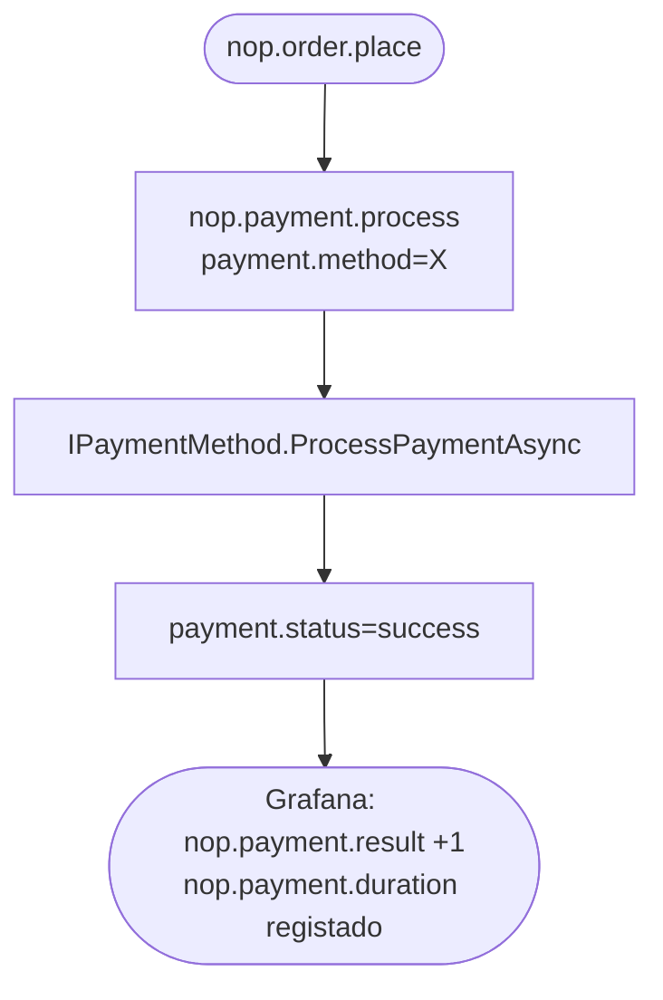
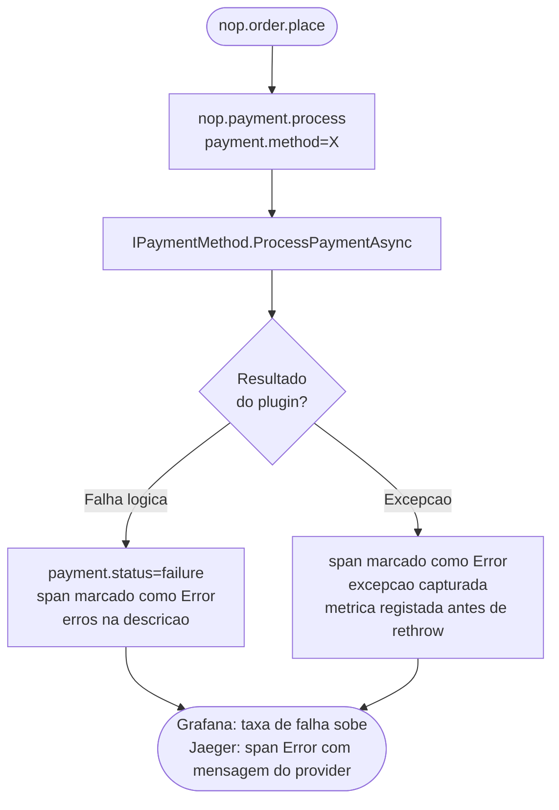
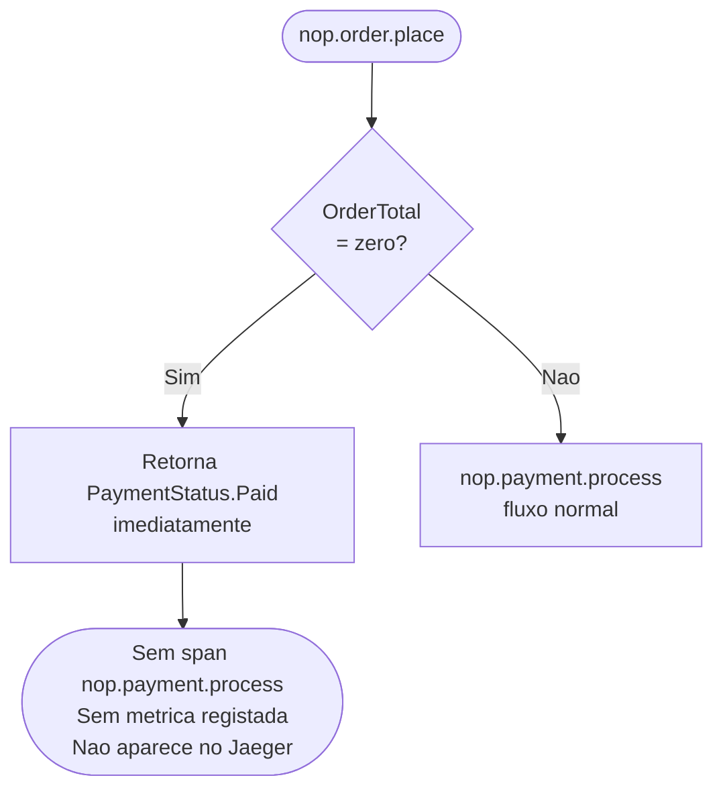

# Observabilidade de Pagamento

## 1. Contexto 

> Onde o Pagamento se Situa no Fluxo de Checkout - Importante

O passo de pagamento é a única fronteira externa no fluxo de checkout (via plugin). Corre dentro de `PlaceOrderAsync` via `GetProcessPaymentResultAsync`, que chama `PaymentService.ProcessPaymentAsync`.

```
HTTP POST /checkout/confirm
  └─ CheckoutController.ConfirmOrder()
       └─ OrderProcessingService.PlaceOrderAsync()      [span: nop.order.place]
            └─ GetProcessPaymentResultAsync()
                 └─ PaymentService.ProcessPaymentAsync() [span: nop.payment.process]
                      └─ IPaymentMethod.ProcessPaymentAsync()   ← fronteira do plugin
```

> **Nota de âmbito importante:** quando `processPaymentRequest.OrderTotal == decimal.Zero`, o método devolve imediatamente com `PaymentStatus.Paid` — nenhum span é criado e nenhuma métrica é registada. Este comportamento é intencional: encomendas gratuitas (valor zero) não envolvem um payment provider e gerar um span para elas poluiria a vista de traces de pagamento com ruído.

---

## 2. Ficheiros Modificados

### `src/Libraries/Nop.Core/Observability/NopMeter.cs`

Define os instrumentos usados pelo subsistema de pagamento:

```csharp
// Conta tentativas de processamento de pagamento, por método e resultado.
// Indica ao operador se o payment provider está a degradar — distinto da
// taxa de falha de checkout, que inclui falhas por razões não relacionadas com pagamento.
public static readonly Counter<long> PaymentResult =
    _meter.CreateCounter<long>(
        name: "nop.payment.result",
        unit: "{attempt}",
        description: "Number of payment processing attempts by method and outcome.");

// Mede exclusivamente a duração da chamada ao plugin de pagamento em milissegundos.
public static readonly Histogram<double> PaymentDuration =
    _meter.CreateHistogram<double>(
        name: "nop.payment.duration",
        unit: "ms",
        description: "Duration of the payment provider call in milliseconds, by method and outcome.");
```

### `src/Libraries/Nop.Services/Payments/PaymentService.cs` — `ProcessPaymentAsync`

```csharp
public virtual async Task<ProcessPaymentResult> ProcessPaymentAsync(ProcessPaymentRequest processPaymentRequest)
{
    // Encomendas com valor zero ignoram o pagamento — sem span, sem métrica
    if (processPaymentRequest.OrderTotal == decimal.Zero)
        return new ProcessPaymentResult { NewPaymentStatus = PaymentStatus.Paid };

    var paymentMethodName = processPaymentRequest.PaymentMethodSystemName;

    using var span = NopActivitySource.Source.StartActivity("nop.payment.process", ActivityKind.Internal);
    span?.SetTag("payment.method", paymentMethodName);

    var sw = Stopwatch.StartNew();
    ProcessPaymentResult paymentResult;
    try
    {
        paymentResult = await paymentMethod.ProcessPaymentAsync(processPaymentRequest);
    }
    catch (Exception ex)
    {
        // Caminho de excepção: marcar span antes de relançar para que o trace o capture
        span?.SetStatus(ActivityStatusCode.Error, ex.Message);
        NopMeter.PaymentResult.Add(1,
            new KeyValuePair<string, object>("payment.method", paymentMethodName),
            new KeyValuePair<string, object>("payment.status", "failure"));
        NopMeter.PaymentDuration.Record(sw.Elapsed.TotalMilliseconds,
            new KeyValuePair<string, object>("payment.method", paymentMethodName),
            new KeyValuePair<string, object>("payment.status", "failure"));
        throw;
    }

    sw.Stop();
    var status = paymentResult.Success ? "success" : "failure";
    span?.SetTag("payment.status", status);
    if (!paymentResult.Success)
        span?.SetStatus(ActivityStatusCode.Error, string.Join("; ", paymentResult.Errors));

    NopMeter.PaymentResult.Add(1,
        new KeyValuePair<string, object>("payment.method", paymentMethodName),
        new KeyValuePair<string, object>("payment.status", status));
    NopMeter.PaymentDuration.Record(sw.Elapsed.TotalMilliseconds,
        new KeyValuePair<string, object>("payment.method", paymentMethodName),
        new KeyValuePair<string, object>("payment.status", status));

    return paymentResult;
}
```

---

## 3. Referência de Spans e Métricas

### Span: `nop.payment.process`

| Tag | Tipo | Quando é definida | Valores de exemplo |
|---|---|---|---|
| `payment.method` | string | início do span | `"Payments.CheckMoneyOrder"`, `"Payments.Manual"` |
| `payment.status` | string | fim do span | `"success"` / `"failure"` |

Quando `payment.status = "failure"`, o estado do span é definido como `Error` com as mensagens de erro do provider como descrição.

**O que está intencionalmente ausente:**
- `payment.order_total` — dados financeiros, sensível ao abrigo do PCI-DSS
- `payment.card_number`, `payment.cvv`, `payment.card_holder` — dados de cartão, nunca emitidos
- `payment.customer_id` — PII; a identidade do cliente já está no span pai `nop.order.place` se necessário para debug (via `order.id`)

### Métricas

| Métrica | Nome Prometheus | Tipo | Tags |
|---|---|---|---|
| `nop.payment.result` | `nopcommerce_nop_payment_result_total` | Counter | `payment_method`, `payment_status` |
| `nop.payment.duration` | `nopcommerce_nop_payment_duration_milliseconds` | Histogram | `payment_method`, `payment_status` |

---

## 4. Painéis do Dashboard Grafana

Os seguintes painéis no dashboard `1 — Checkout Business KPIs` cobrem o subsistema de pagamento:

| Painel | Tipo | O que mostra | Quando é accionável |
|---|---|---|---|
| Total de Pagamentos | Stat | Contagem cumulativa na janela seleccionada | Cai para zero → pipeline de checkout avariado |
| Pagamentos com Sucesso | Stat | Contagem com `payment_status="success"` | Declínio sustentado → provider a degradar |
| Pagamentos Falhados | Stat | Contagem com `payment_status="failure"` | Qualquer valor não-zero → investigar provider |
| Taxa de Pagamentos — Sucesso vs Falha | Timeseries | `rate(...)` dividido por `payment_status` | Taxa de falha a subir → problema no gateway de pagamento |
| Duração do Payment Provider p50/p95/p99 | Timeseries | Percentis de `nop.payment.duration` | Se sobe em conjunto com duração do checkout → gateway é o bottleneck |

O painel de traces no mesmo dashboard (`Traces Recentes de Colocação de Encomendas`) mostra `nop.payment.process` como span filho. Clicar num trace mostra o resultado e duração do pagamento em relação ao resto do fluxo de encomenda.

---

## 5. Casos de Uso

Aplicar este tipo de telemetria no service Payment pode vir a ser útil para:

- Verificar os pagamentos com sucesso;
- Se o plugin de pagamento devolve falha;
- Encomendas com o valor zero (encomendas gratuitas devolvem `PaymentStatus`.Paid antes de atingir o plugin. Nenhum span é criado.)

---

## 6. Fluxogramas de Investigação

### Caso 1 — Pagamento com Sucesso



### Caso 2 — Plugin Devolve Falha



### Caso 3 — Encomenda com Valor Zero


