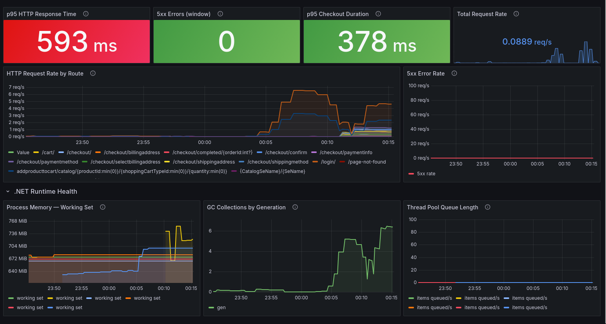
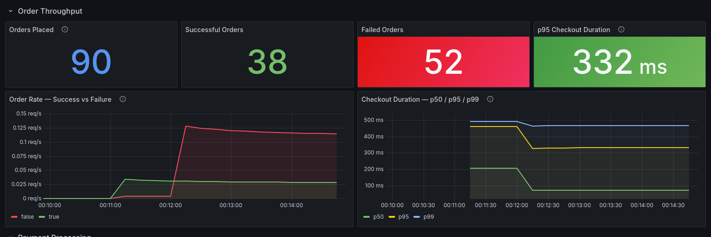
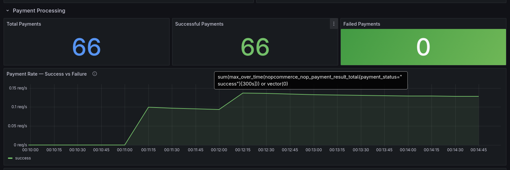
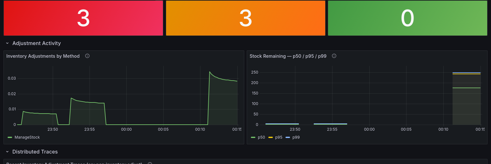
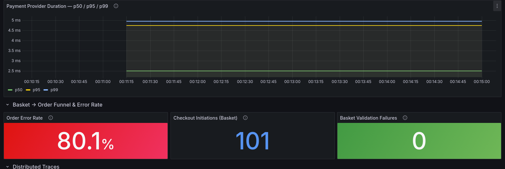

# Testes de Carga

## Propósito dos Testes de Carga

Os testes de carga não servem para verificar se o sistema funciona (para isso existe o smoke test), mas servem para responder a uma pergunta diferente:

> **"O que acontece ao sistema quando muitos utilizadores fazem o mesmo ao mesmo tempo?"**

No contexto deste projecto, o objectivo específico é triplo:

**1. Validar a instrumentação sob pressão real**
  - Ou seja, que queremos provar é que os spans, métricas e traces continuam correctos, completos e correlacionados quando há 20 utilizadores simultâneos a gerar tráfego (**instrumentação robusta**).

**2. Tornar os dashboards significativos**
  - Os testes de carga são o que dá vida aos painéis que configurámos.

**3. Demonstrar o valor da observabilidade de negócio**
  - A diferença entre observabilidade técnica (HTTP 200/500) e observabilidade de negócio (encomendas colocadas, pagamentos falhados, stock esgotado) só é visível quando há carga suficiente para criar eventos de negócio mensuráveis. Com 20 VUs em paralelo, vemos em tempo real o que normalmente só seria detectado horas depois por relatórios ou reclamações de clientes.

### O que o teste simula

O `checkout-load-test.js` simula o fluxo completo de um cliente real:

Cada Virtual User (VU) executa este fluxo em loop durante o período de teste. O perfil de carga é progressivo (não começa com 20 VUs de imediato).

---

## O Cenário: Black Friday num E-Commerce

Imaginanemos que somos o responsável técnico de uma loja online de livros. É sexta-feira à noite e acabou de começar uma campanha promocional (a black-friday). O tráfego dispara de repente, utilizadores a fazer login, a adicionar produtos ao carrinho, a confirmar encomendas em simultâneo.

Sem observabilidade, a única forma de saber que algo correu mal é um email de um cliente a dizer que a encomenda não chegou. Com a stack que implementámos, temos visibilidade em tempo real de tudo o que acontece no sistema, ao nível do código.

---

## Perfil de Carga — O que Aconteceu no Teste

> Durante este período: **90 tentativas de checkout, 38 encomendas bem-sucedidas, 66 pagamentos processados com sucesso.**

---

## Caso de Uso 1 — "O sistema está lento ou está partido?"

### dashboard Service Health

>  dashboard Service Health durante o pico

O gráfico **HTTP Request Rate by Route** mostra todas as rotas do checkout a subir em simultâneo durante o pico:
- `/addproducttocart` — utilizadores a adicionar ao carrinho
- `/checkout/billingaddress`, `/checkout/shippingmethod`, `/checkout/paymentmethod` — pipeline de checkout
- `/checkout/confirm` — confirmações a chegar em rajada

O **.NET Runtime** mostra:
- **Memory Working Set** a subir de ~640MB para ~750MB — o processo está a consumir mais memória sob carga
- **GC Collections Gen0** a disparar até 6 colecções/segundo — o Garbage Collector está a trabalhar para libertar objectos temporários criados por cada pedido
- **Thread Pool Queue Length** a permanecer em 0 — sem starvation de threads

### O que significa na prática

**Com este dashboard:** em 30 segundos identificas que:
1. Não há erros 5xx → o sistema não está partido, está apenas sob pressão
2. p95 = 593ms → 5% dos pedidos demoram mais de meio segundo — aceitável mas monitorizar
3. GC activo mas sem thread starvation → o runtime está saudável, o problema é carga pura
4. **Decisão correcta:** aumentar o número de instâncias (scale out) em vez de rollback ou reinício

### Porquê estas métricas

- **p95 em vez de média** — a média esconde os casos lentos. Se p50=50ms mas p95=593ms, significa que 1 em cada 20 utilizadores tem uma experiência muito pior que os outros. Em e-commerce, esse utilizador abandona o carrinho.
- **5xx separado do p95** — latência alta sem erros 5xx é um problema diferente de latência alta com erros. O primeiro é "lento", o segundo é "partido".
- **GC por geração** — Gen0 frequente é normal (objectos de curta duração). Gen2 frequente é um sinal de leak de memória. Aqui só vemos Gen0 — o sistema está saudável.

---

## Caso de Uso 2 — "Quantas encomendas estamos a processar e a que custo?"

### O que vês no dashboard Checkout Business KPIs

> dashboard Checkout KPIs durante o pico 

O gráfico **Order Rate — Success vs Failure** mostra:
- Linha verde (sucesso) a subir a partir das 00:11 e a estabilizar
- Linha vermelha (falha) a subir mais rapidamente que o sucesso durante o pico

O gráfico **Checkout Duration p50/p95/p99**:
- Durante o pico (00:11-00:12): p50≈200ms, p95≈500ms, p99≈500ms
- Após o pico (00:12+): p50 cai para ~50ms, mas p95 e p99 mantêm-se elevados

### O que isto significa na prática

**O leque p50/p95/p99 que se abre durante o pico** é um dos sinais mais importantes de observabilidade de e-commerce. Significa:

> "A maioria dos utilizadores tem uma experiência rápida (p50=200ms), mas uma minoria significativa está a esperar muito mais (p99=500ms). Essa minoria são os utilizadores que chegaram ao sistema exactamente quando estava mais congestionado."

**Os 52 Failed Orders** neste teste específico resultam de uma limitação do setup de teste (20 VUs a partilhar o mesmo utilizador, causando conflitos de carrinho). Em produção, este número corresponderia a:
- Utilizadores que tentaram comprar um produto que esgotou entretanto
- Sessões que expiraram durante o checkout
- Erros de validação de morada ou pagamento

### Porquê estas métricas

- **Orders Placed vs Successful vs Failed** — a diferença entre "tentou comprar" e "comprou" é o que define a taxa de conversão. Uma taxa de falha de 10% em checkout é normal; 50% é uma crise de negócio.
- **Checkout Duration como SLO** — os SLAs de e-commerce definem-se tipicamente como "95% dos checkouts completam em menos de 3 segundos". O p95=332ms está muito abaixo desse limite — margem de segurança confirmada.
- **Taxa de sucesso ao longo do tempo** — se a linha verde cai enquanto a vermelha sobe, é sinal de degradação progressiva (ex: base de dados a encher, lock contention, memória a esgotar).

---

## Caso de Uso 3 — "O processador de pagamento está a causar a lentidão?"

### O que vês no Payment Processing

> secção Payment Processing do mesmo dashboard

O gráfico **Payment Rate — Success vs Failure** mostra apenas a linha de sucesso a subir — nenhuma falha de pagamento durante todo o teste.

### O que isto significa na prática

> **ESTE É O VALOR!!!**

**Cenário clássico pela auditoria:** o checkout está lento (p95=593ms). A primeira suspeita da equipa financeira é o processador de pagamento externo — "deve ser a API do Stripe/PayPal que está lenta". Sem observabilidade, abre-se um ticket com o fornecedor, reunião de crise, etc.

**Com este painel:** em 10 segundos a equipa vêq ue o processamento de pagamento demora **2.5ms a 5ms**, o erro está noutro lado. Neste caso, está nas operações de base de dados (visível nos traces do Jaeger: `db.insert Order` = 50ms, `db.update Order` = 36ms).

### Porquê estas métricas

- **Payment Duration separado do Checkout Duration** — isola o componente externo. Se o p99 do pagamento disparasse, saberiamos que o problema é o fornecedor. Se mantiver baixo (como aqui), o problema é interno.
- **Failed Payments como alerta de negócio** — uma taxa de falha de pagamento de 5% em produção representa dinheiro concreto perdido por hora. Este é o tipo de métrica que acorda pessoas às 3h da manhã.
- **100% success rate** — prova que a integração com o método de pagamento (Payments.Manual neste caso) está funcional sob carga concorrente.

> Use case util para ver se o erro é no nosso lado ou externo

---

## Caso de Uso 4 — "O stock está a aguentar a campanha?"

### O que vês no dashboard Inventory Impact

> dashboard Inventory Impact durante a carga

O gráfico **Inventory Adjustments by Method** mostra três picos distintos (os três testes de stock depletion) seguidos de um pico maior (load test), todos com o método `ManageStock`.

O gráfico **Stock Remaining p50/p95/p99** mostra valores que chegam a 250 (reset do stock antes do load test) e descem progressivamente durante os ajustes.

### O que isto significa na prática

**Cenário:** durante a campanha de Black Friday, um produto popular começa a esgotar.

**Com este dashboard:**
- **O pico de ajustes às 23:50** corresponde ao primeiro teste de stock depletion (5 unidades esgotadas)
- **O segundo pico maior** corresponde ao load test — encomendas a acontecer em simultâneo, cada uma a decrementar o stock
- **Stock-Outs: 3** — em três momentos distintos, o stock chegou a zero. Cada momento é um risco de oversell

**O valor da correlação temporal:** vendo os dois gráficos juntos (ajustes + stock restante), é possível reconstruir exactamente a sequência de eventos: quando começaram as encomendas, a que ritmo o stock foi consumido, e em que momento exato ocorreu a ruptura.

### Porquê estas métricas

- **Inventory Adjustments por método** — distingue `ManageStock` (produto físico com controlo de stock) de `DontManageStock` (produto digital ou sem controlo). Um pico em `DontManageStock` seria anomalia.
- **Stock Remaining como histograma** — a distribuição p50/p95/p99 do stock captura a variabilidade entre produtos. Se p50=2 mas p99=200, significa que a maioria dos produtos está quase esgotada mas alguns têm stock abundante.
- **Low-Stock Alert separado do Stock-Out** — o alerta de stock baixo é um aviso prévio. Se a equipa reagir quando este dispara (reordenar produto ao fornecedor), a ruptura pode ser evitada. Sem este alerta, a ruptura é a primeira notificação.

---

## Caso de Uso 5 — "O funil de checkout está a converter?"

### O que vês na secção Basket → Order Funnel

> secção Basket Funnel do dashboard Checkout KPIs

### O que isto significa na prática

**O funil de checkout** é o conceito mais importante de e-commerce: de cada 100 utilizadores que adicionam algo ao carrinho, quantos chegam ao fim e pagam?

Neste teste, **101 checkouts iniciados** resultaram em **38 encomendas completas** — uma taxa de conversão de ~38%.

**Basket Validation Failures = 0** é um dado crítico: nenhum utilizador tentou fazer checkout com um carrinho inválido (produto inexistente, preço alterado, quantidade impossível).

**O Order Error Rate de 80.1%** neste contexto específico resulta de uma limitação do teste (todos os VUs partilham o mesmo utilizador). Em produção, este número corresponderia a pedidos que chegaram ao endpoint de confirmação mas falharam — por stock esgotado, sessão expirada, ou erro de pagamento. É exactamente o tipo de falha silenciosa que é invisível nos logs HTTP.

---

## O Valor das Métricas Escolhidas — Visão Global

| Métrica | Camada | O que detecta | Sem ela, detectas como? |
|---|---|---|---|
| `p95 checkout duration` | HTTP | Degradação de cauda de latência | Reclamações de utilizadores |
| `orders_completed` | Negócio | Taxa de conversão real | Relatório de vendas (D+1) |
| `payment.status=failure` | Negócio | Falhas de pagamento silenciosas | Email de cliente (D+2) |
| `inventory.stock_after` | Inventário | Progressão do stock em tempo real | Relatório de stock (D+1) |
| `inventory.stockouts` | Inventário | Ruptura de stock | Email de cliente (D+2) |
| `gc_collections` | Runtime | Pressão de memória / leaks | Crash do processo |
| `thread_pool_queue` | Runtime | Saturação de threads | Timeout generalizado |
| `http_req_failed` | HTTP | Erros de servidor | Alertas de uptime |

**O padrão comum:** sem observabilidade, todas as falhas de negócio são detectadas pelos clientes, com um atraso de horas ou dias. Com a stack implementada, são detectadas em segundos, com contexto suficiente para agir, ou seja, um programador que acorde às 2h manhã não encontraria o erro sem estes dados de observabilidade.

