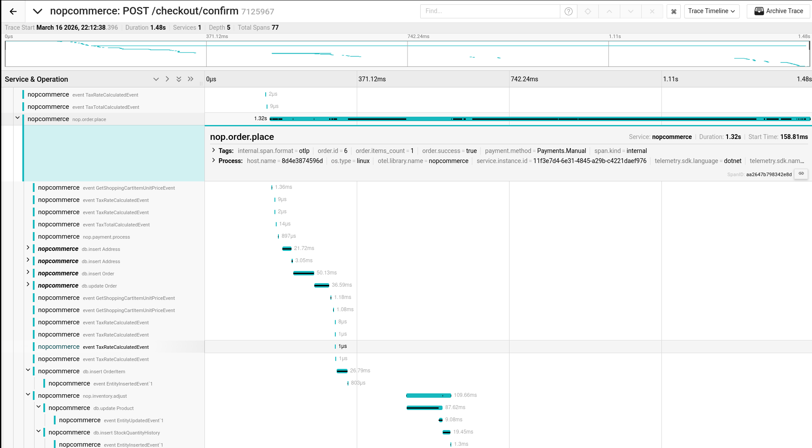
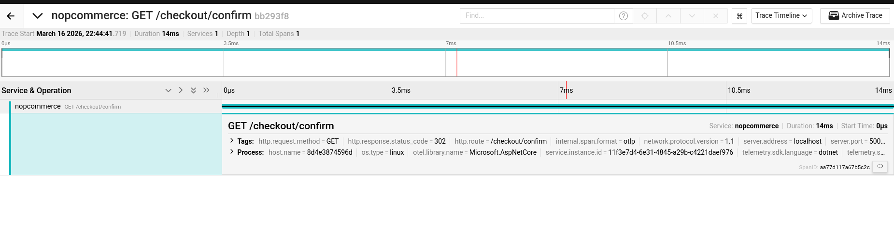

# Smoke-tests

> Testes mínimos que verificam se o sistema básico funciona.

- O que fazem:
  - Correm 1 utilizador, 1 iteração, 1 vez
  - Percorrem o caminho principal do sistema
  - Não medem desempenho, não geram carga

- Para que servem:
  - Sanidade do ambiente — confirmar que tudo está ligado e configurado antes de correr testes mais pesados
  - Deteção rápida de falhas óbvias — se o smoke test falha, os testes de carga não têm validade (estariam a medir falhas, não performance)
  - Baseline — estabelecer que em condições normais (0 pressão) o sistema funciona

Para este projeto fizemos dois principais teses minimos:
  1. Cenário completo — faz um checkout completo do início ao fim;
  2. Cenário de empty car — tenta confirmar uma encomenda com o carrinho vazio (o sistema bloqueia).

## Trace completo de uma encomenda (Jaeger)

Este trace representa o fluxo completo de uma encomenda colocada com sucesso. O pedido entra pelo endpoint `POST /checkout/confirm` e desencadeia muitas operações em múltiplas camadas da aplicação.

- O span raiz `nop.order.place` é um span personalizado. Não gerado automaticamente pelo OpenTelemetry, mas adicionado manualmente ao código do serviço de encomendas;
- As tags do span mostram order.id, order.items_count, order.success=true e payment.method (Sem apresentar nenhum dado pessoal);
- O `span nop.payment.process` confirma que o pagamento foi processado;
- O `span nop.inventory.adjust`` com os seus filhos db.update Product e db.insert StockQuantityHistory confirma que o stock foi alterado;

Com este teste:

1. Prova que a instrumentação personalizada funciona. O `span nop.order.place` (não é gerado automaticamente pelo OpenTelemetry, foi adicionado manualmente ao código do serviço de encomendas).

2. **Prova a protecção de PII**. As tags do span  não mostram o email do cliente, a morada de entrega, nem o valor total da encomenda;

3. Profundidade e cobertura. 77 spans distribuídos por 5 níveis de profundidade demonstram que a instrumentação foi aplicada sobre múltiplas camadas da arquitectura (Presentation → Services → Data), não apenas o endpoint HTTP.

## Trace de carrinho vazio (Jaeger)

Um trace muito curto (< 20ms) para `GET /checkout/confirm` sem nenhum span filho. O HTTP termina com um redirect (302). Este trace representa uma tentativa de confirmar uma encomenda com o carrinho vazio:

- A duração é de apenas 17.56ms (contra os ~200ms do trace completo);
- Não existe nenhum span filho: sem nop.order.place, sem nop.payment.process, sem nenhum db.insert
- O pedido termina com um redirect (302) que envia o utilizador de volta ao carrinho
- A ausência de spans é o ponto-chave para visualizar que o sistema detectou o estado inválido antes de processar qualquer operação, protegendo a consistência dos dado

Através do trace conseguimos perceber:

- Prova que o sistema rejeita estados inválidos antes de os processar. Se um utilizador tentar confirmar uma encomenda com o carrinho vazio, o sistema deteta (sem chamar o serviço de pagamento, sem inserir nada na base de dados).

- **Não cria falsos positivos**. O span nop.order.place só aparece quando uma encomenda é de facto processada
