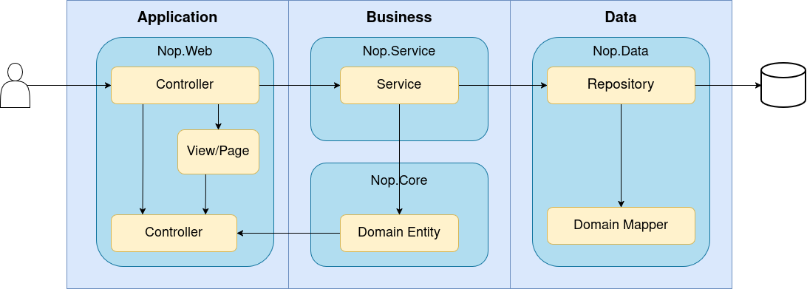

#  nopCommerce — Architecture

--- 

O sistema está organizado em camadas em que cada camada tem uma responsabilidade especifica, seguindo princípios de separação de preocupações (separation of concerns). Cada camada comunica com as camadas adjacentes através de interfaces, promovendo o low coupling e a testabilidade do código.

---

## 1. Layer Organisation

### 1.1 Dois Padrões Arquitecturais em Coexistência

> Vou apresentar dois padrões arquiteturais que respondem a diferentes perguntas.

#### Padrão A — Layered Architecture (N-Tier)

**O que é:** A arquitectura em camadas, também chamada N-Tier, organiza o sistema em camadas horizontais.

```
Presentation  →  Business Logic  →  Data Access  →  Database
```



**A regra é estrita:** a camada de Apresentação não pode saltar directamente para a Data Access — tem de passar sempre pela Business Logic. Isto cria fronteiras claras e previsíveis. **Isto é importante para observabilidade** pois numa arquitectura N-Tier, pode-se instrumentar apenas a fronteira entre camadas e ter a garantia de que toda a lógica de negócio passa por ali.


#### Padrão B — Onion Architecture

> Proposta por Jeffrey Palermo em 2008, a **Onion Architecture** organiza o sistema em **camadas concêntricas** em vez de horizontais. A regra não é "fala só com a camada ao lado", é mais abrangente, **todas as dependências apontam para o centro, nunca para fora**.


A camada exterior pode referenciar qualquer camada mais interior. O que nunca pode acontecer é uma camada interior referenciar uma exterior. `Nop.Core` não pode conhecer `Nop.Services`. `Nop.Services` não pode conhecer `Nop.Web`. Mas `Nop.Web` pode referenciar directamente `Nop.Core`, `Nop.Data` e `Nop.Services`. **É importante para observabilidade:** A Onion Architecture não garante que o fluxo sempre passe pelos Services. Um Controller pode, estruturalmente, chamar um Repository directamente. Isto significa que instrumentar apenas a camada de Services não chega.

---

## 2. Descrição de Cada Camada

### 2.1 Nop.Core — Centro

O projecto mais interior. Sem referências a outros projectos Nop. Define:
- **Entidades de domínio** — `BaseEntity`, `Customer`, `Order`, `Product`, etc.
- **Mecanismo de eventos** — `IEventPublisher`, `IConsumer<T>`, eventos de domínio
- **Infraestrutura** — `NopEngine`, `EngineContext`, `INopStartup`
- **Cache** — `ICacheManager`, `CacheKey`
- **Configuração** — `ISettings`, `AppSettings`

É o contrato partilhado por todo o sistema. Qualquer camada pode depender desta, mas esta não pode depender de ninguém.

### 2.2 Nop.Data — Acesso a Dados

Implementa o padrão Repository com `IRepository<T>` e `EntityRepository<T>`. Usa **linq2db** como ORM e **FluentMigrator** para migrações de esquema. Suporta três bases de dados: SQL Server, MySQL e PostgreSQL.

### 2.3 Nop.Services — Lógica de Negócio

A camada do sistema com mais de 60 serviços de domínio organizados por contexto: `OrderProcessingService`, `CustomerService`, `PaymentService`, `CatalogueService`, `ShoppingCartService`, ... Os serviços são registados como **Scoped** (por pedido HTTP) no container de DI, comunicam entre si por injecção directa de dependências, e podem publicar e consumir eventos de domínio via `IEventPublisher` / `IConsumer<T>`.

### 2.4 Nop.Web — Camada de Apresentação

Aplicação ASP.NET Core MVC que serve a interface pública da loja e o painel de administração.

**Responsabilidades:**
- **Controllers** — recebem pedidos HTTP e delegam para serviços
- **Views/Pages** — templates Razor para renderização de HTML
- **Models** — objectos de transferência de dados entre Controllers e Views
- **Factories** — constroem ViewModels complexos a partir de dados do domínio

### 2.5 Plugins — Extensibilidade Dinâmica

Carregados em runtime via `ITypeFinder`. Cada plugin referencia `Nop.Web` e obtém acesso transitivo a todo o stack. Implementam interfaces de extensão como `IPaymentMethod`, `IShippingRateComputationMethod`, `IWidgetPlugin`, etc. O sistema de plugins permite adicionar funcionalidade sem modificar o código base.

---

## 3. Comunicação Entre Camadas

O nopCommerce usa dois mecanismos de comunicação internos:

- **Chamadas directas por injecção de dependências**: O caminho principal. Controllers chamam Services, Services chamam Repositories. É síncrono e directo.

- **IEventPublisher — eventos de domínio in-process**: Qualquer componente pode publicar um evento (`await _eventPublisher.PublishAsync(new OrderPlacedEvent(order))`), e todos os `IConsumer<T>` registados são invocados automaticamente pelo `EventPublisher`. É o mecanismo que desacopla, por exemplo, a invalidação de cache da lógica de negócio.


### 3.1 IEventPublisher

#### O que é

O `IEventPublisher` é o **sistema de eventos in-process** do nopCommerce. É o mecanismo que permite que diferentes partes do sistema comuniquem entre si sem que o remetente saiba quem vai receber a mensagem. Em vez de um serviço chamar directamente outro, publica um evento e todos os componentes registados para esse tipo de evento são notificados automaticamente (**não é um message broker**). Tudo acontece **in-process**, dentro da mesma instância da aplicação, durante o mesmo pedido HTTP.


---

Sources:
- [Architecture of nopCommerce — Official Docs](https://docs.nopcommerce.com/en/developer/tutorials/architecture-of-nopCommerce.html)
- [Source Code Organization — Official Docs](https://docs.nopcommerce.com/en/developer/tutorials/source-code-organization.html)
- [The Architecture behind the nopCommerce eCommerce Platform - Official youtube video](https://www.youtube.com/watch?v=6gLbizzSA9o&list=PLnL_aDfmRHwtJmzeA7SxrpH3-XDY2ue0a)
