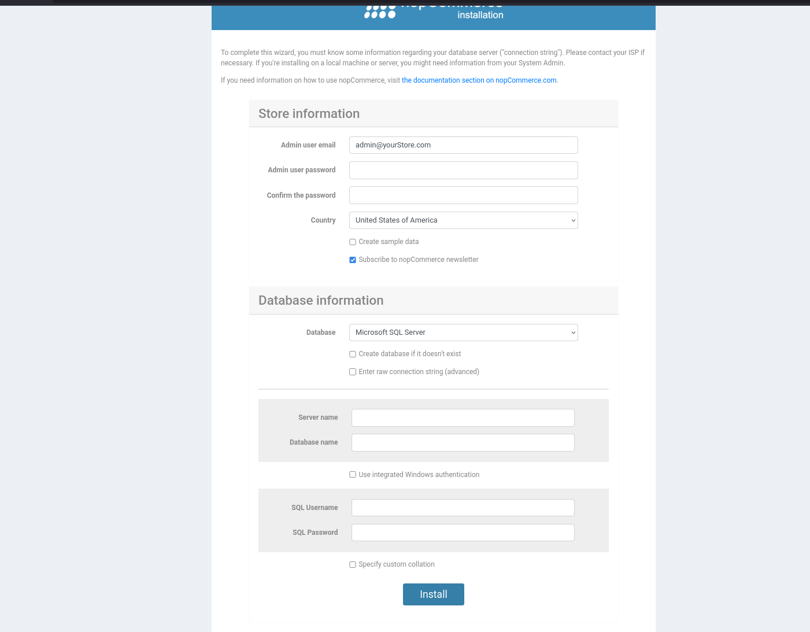

# Como Correr o Projecto

## Pré-requisitos

| Ferramenta | Versão mínima | Verificar |
|---|---|---|
| .NET SDK | 9.0 | `dotnet --version` |
| Docker + Docker Compose | qualquer recente | `docker compose version` |

---

## Passo 1 — Arrancar o PostgreSQL

O nopCommerce usa PostgreSQL como base de dados. Na primeira vez, arranca um container:

```bash
docker run -d \
  --name nopcommerce_postgres_server \
  -e POSTGRES_PASSWORD=nopCommerce_db_password \
  -e POSTGRES_USER=postgres \
  -e POSTGRES_DB=nopcommerce \
  -p 5432:5432 \
  postgres:latest
```

Ativa a extensão `citext` (necessária para o nopCommerce):
```bash
docker exec nopcommerce_postgres_server \
  psql -U postgres -d nopcommerce \
  -c "CREATE EXTENSION IF NOT EXISTS citext;"
```

> Nas vezes seguintes, basta apenas arrancar o container que já existe:
> ```bash
> docker start nopcommerce_postgres_server
> ```

---

## Passo 2 — Arrancar a stack de observabilidade

```bash
cd nopCommerce/observability

docker compose -f docker-compose.observability.yml up -d
```

---

## Passo 3 — Arrancar o nopCommerce

```bash
cd nopCommerce/src/Presentation/Nop.Web

ASPNETCORE_ENVIRONMENT=Development dotnet run
```

> `ASPNETCORE_ENVIRONMENT=Development` é necessário para ativar o endpoint OTLP definido em `App_Data/appsettings.Development.json`, que envia telemetria para o OTel Collector.

---

## Passo 4 — Na primeira instalação

Na primeira execução, o nopCommerce redireciona automaticamente para `http://localhost:5000/install`.



Preenche o formulário da seguinte forma:

**Store information**
| Campo | Valor |
|---|---|
| Admin user email | qualquer email (ex: `admin@admin.com`) |
| Admin user password | password à tua escolha |
| Confirm the password | repetir a password |
| Country | Um qualquer |
| Create sample data | opcional |

**Database information**
| Campo | Valor |
|---|---|
| Database | **PostgreSQL** |
| Enter raw connection string (advanced) | ✔ activar |
| Connection string | `Host=localhost;Database=nopcommerce;Username=postgres;Password=nopCommerce_db_password` |

Clica em **Install** e aguarda (1-2 minutos). O wizard escreve a connection string em `App_Data/appsettings.json` e a app fica disponível em `http://localhost:5000`.

> Nas execuções seguintes, o wizard não aparece — a app arranca diretamente.

> **Reinstalação / erro no wizard:** se precisares de recomeçar do zero, para o nopCommerce, limpa a DB e volta ao Passo 3:
> ```bash
> docker exec nopcommerce_postgres_server \
>   psql -U postgres -c "DROP DATABASE nopcommerce; CREATE DATABASE nopcommerce;"
> docker exec nopcommerce_postgres_server \
>   psql -U postgres -d nopcommerce -c "CREATE EXTENSION IF NOT EXISTS citext;"
> ```

---

## Passo 5 — Verificar que a observabilidade está activa

| UI | URL | O que ver |
|---|---|---|
| nopCommerce | http://localhost:5000 | Loja |
| Jaeger | http://localhost:16686 | Traces |
| Prometheus | http://localhost:9090 | Métricas |
| Grafana | http://localhost:3000 | Dashboards (user: `admin`, pass: `admin`) |

No **Jaeger**, selecciona o serviço `nopcommerce` e clica em **Find Traces** — deverás ver traces dos pedidos HTTP que fizeste.

---

## Parar tudo

```bash
# Parar o nopCommerce
# (Ctrl+C na consola onde está a correr)

# Parar os containers
docker stop nopcommerce_postgres_server
cd nopCommerce/observability
docker compose -f docker-compose.observability.yml down
```

