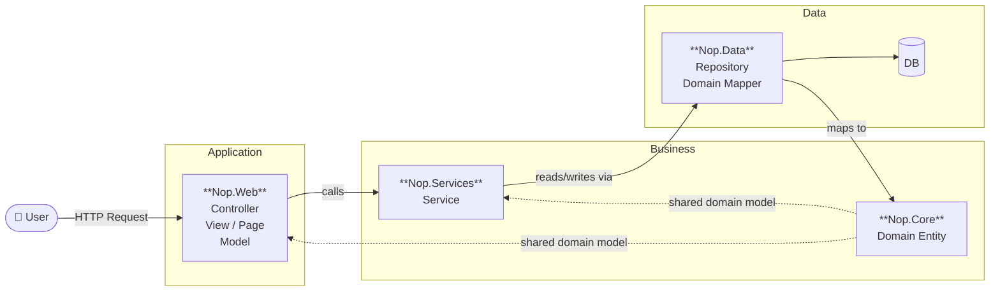
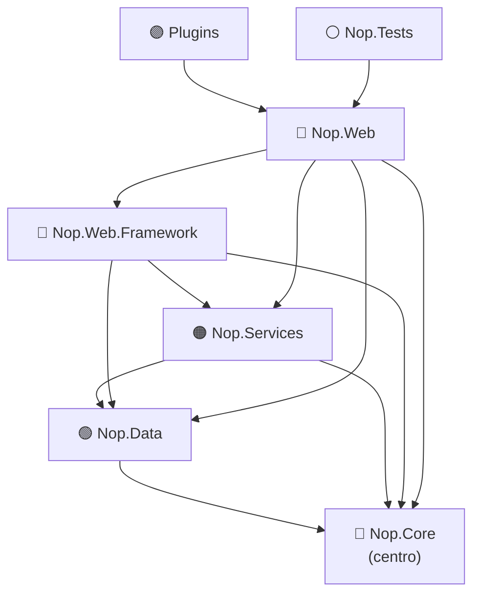
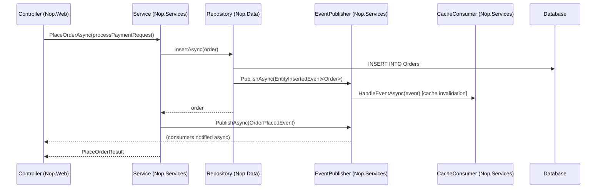
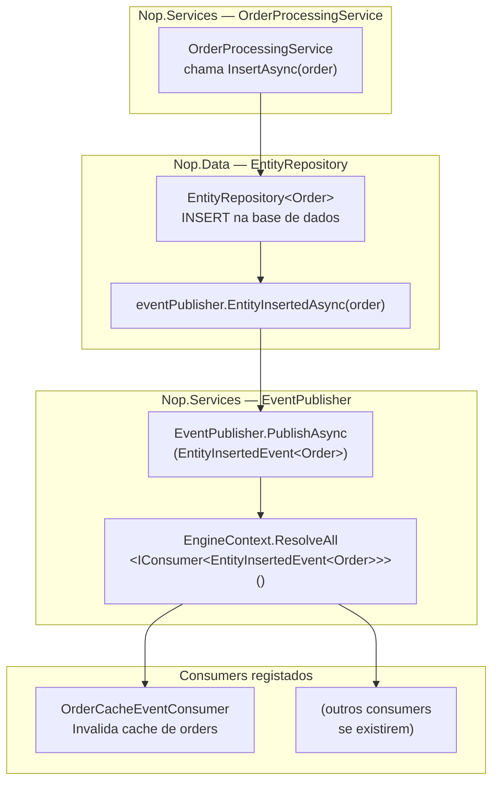
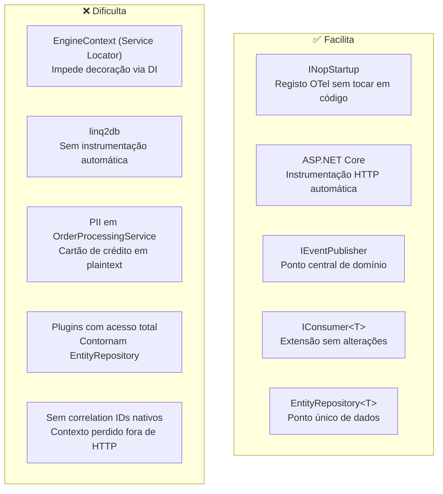

# nopCommerce — Architectural Analysis

> Assignment 01 — Observability in the Wild

---

## 1. Layer Organisation and Dependency Rules

### 1.1 Dois Padrões Arquitecturais em Coexistência

O nopCommerce apresenta dois padrões arquitecturais que coexistem e respondem a perguntas diferentes. É importante perceber a diferença porque cada um tem implicações distintas — nomeadamente para a instrumentação de observabilidade.

---

#### Padrão A — Layered Architecture (N-Tier)

**O que é:** A arquitectura em camadas, também chamada N-Tier, organiza o sistema em camadas horizontais com uma regra simples: **cada camada só comunica com a camada imediatamente abaixo**. É o modelo mais antigo e mais intuitivo de organizar código empresarial.

```
Presentation  →  Business Logic  →  Data Access  →  Database
```

A regra é estrita: a camada de Apresentação não pode saltar directamente para a Data Access — tem de passar sempre pela Business Logic. Isto cria fronteiras claras e previsíveis.

**O que representa no nopCommerce:** O fluxo intencional mostrado no diagrama oficial (Controller → Service → Repository → DB). É a forma como o sistema está desenhado para ser usado na grande maioria dos casos.

**Porque é importante para observabilidade:** Numa arquitectura N-Tier estrita, pode-se instrumentar apenas a fronteira entre camadas e ter a garantia de que toda a lógica de negócio passa por ali. É simples e previsível.

---

#### Padrão B — Onion Architecture

**O que é:** Proposta por Jeffrey Palermo em 2008, a Onion Architecture (também relacionada com a *Hexagonal Architecture* de Alistair Cockburn e a *Clean Architecture* de Robert C. Martin) organiza o sistema em **camadas concêntricas** em vez de horizontais. A regra não é "fala só com a camada ao lado" — é mais abrangente: **todas as dependências apontam para o centro, nunca para fora**.

```
         ┌─────────────────────────────┐
         │        Presentation         │
         │   ┌─────────────────────┐   │
         │   │      Services       │   │
         │   │   ┌─────────────┐   │   │
         │   │   │    Data     │   │   │
         │   │   │  ┌───────┐  │   │   │
         │   │   │  │ Core  │  │   │   │
         │   │   │  └───────┘  │   │   │
         │   │   └─────────────┘   │   │
         │   └─────────────────────┘   │
         └─────────────────────────────┘
              Dependências → centro
```

A camada exterior pode referenciar qualquer camada mais interior — não apenas a adjacente. O que nunca pode acontecer é uma camada interior referenciar uma exterior. `Nop.Core` não pode conhecer `Nop.Services`. `Nop.Services` não pode conhecer `Nop.Web`. Mas `Nop.Web` pode referenciar directamente `Nop.Core`, `Nop.Data` e `Nop.Services`.

**O que representa no nopCommerce:** A estrutura real confirmada nos `.csproj`. A documentação oficial descreve-o explicitamente como *"very close to onion architecture"*.

**Porque é importante para observabilidade:** A Onion Architecture não garante que o fluxo sempre passe pelos Services. Um Controller pode, estruturalmente, chamar um Repository directamente. Isto significa que instrumentar apenas a camada de Services não chega — pode existir acesso a dados que escapa completamente à instrumentação. É necessário uma abordagem mais defensiva.

---

#### A Relação Entre os Dois

Os dois padrões não se contradizem — **descrevem o mesmo sistema em níveis diferentes**:

| | Layered (N-Tier) | Onion Architecture |
|---|---|---|
| **Descreve** | O fluxo intencional de execução | A estrutura de dependências entre projectos |
| **Pergunta que responde** | Como é que um pedido HTTP deve fluir? | O que é que cada projecto pode referenciar? |
| **Nível** | Runtime / comportamental | Compile-time / estrutural |
| **Aplicação no nopCommerce** | Controller → Service → Repository (caminho normal) | Nop.Web pode referenciar Nop.Data directamente (permitido mas não intencional) |
| **Garantia** | Por convenção — ninguém te obriga | Por compilador — o compilador impede dependências para fora |

O diagrama oficial mostra o **caminho que deve ser seguido** (N-Tier). Os `.csproj` mostram **o que o compilador permite** (Onion). Na maioria do código do nopCommerce, ambos coincidem. Mas a ausência de uma fronteira estrutural estrita significa que existem excepções — e são essas excepções que tornam a observabilidade mais complexa de implementar correctamente.

---

O diagrama de alto nível, publicado pela conta oficial em vídeo, organiza os projectos em três grupos funcionais — reflectindo o fluxo intencional N-Tier:



> **Leitura do diagrama:** o utilizador faz um pedido HTTP → o Controller (Nop.Web) invoca um Service (Nop.Services) → o Service usa um Repository (Nop.Data) para aceder à base de dados. O `Nop.Core` fornece as entidades de domínio partilhadas por todos os grupos.

---

### 1.2 Dependências Reais — Confirmadas nos `.csproj`

| Projecto | Referencia (ProjectReference) | Grupo |
|---|---|---|
| `Nop.Core` | — (sem dependências internas) | Business / Centro |
| `Nop.Data` | `Nop.Core` | Data |
| `Nop.Services` | `Nop.Core` + `Nop.Data` | Business |
| `Nop.Web.Framework` | `Nop.Core` + `Nop.Data` + `Nop.Services` | Application (infra) |
| `Nop.Web` | `Nop.Core` + `Nop.Data` + `Nop.Services` + `Nop.Web.Framework` | Application |
| Plugins (×30+) | `Nop.Web` (acesso transitivo a tudo) | Extensibilidade |
| `Nop.Tests` | `Nop.Web` (acesso transitivo a tudo) | Testes |



**Regra fundamental:** nenhuma seta aponta para cima. `Nop.Core` não conhece `Nop.Data`, `Nop.Services` não conhece `Nop.Web`. A direcção de dependência é sempre de fora para dentro — o que define uma onion architecture correcta.

---

### 1.3 Descrição de Cada Camada

#### Nop.Core — Centro da Cebola

O projecto mais interior. Sem referências a outros projectos Nop. Define:
- **Entidades de domínio** — `BaseEntity`, `Customer`, `Order`, `Product`, etc.
- **Mecanismo de eventos** — `IEventPublisher`, `IConsumer<T>`, eventos de domínio
- **Infraestrutura de DI** — `NopEngine`, `EngineContext`, `INopStartup`
- **Cache** — `ICacheManager`, `CacheKey`
- **Configuração** — `ISettings`, `AppSettings`

É o contrato partilhado por todo o sistema. Qualquer projecto pode depender daqui, mas este projecto não pode depender de ninguém.

**Nota:** `Nop.Core` inclui pacotes NuGet de `Microsoft.AspNetCore.Mvc`, o que cria um acoplamento ao framework web mesmo na camada mais central — uma limitação do design actual.

#### Nop.Data — Acesso a Dados

Implementa o padrão Repository com `IRepository<T>` e `EntityRepository<T>`. Usa **linq2db** como ORM (em vez do Entity Framework Core mais comum) e **FluentMigrator** para migrações de esquema. Suporta três bases de dados: SQL Server, MySQL e PostgreSQL.

Os repositórios publicam automaticamente eventos de domínio (`EntityInsertedEvent<T>`, `EntityUpdatedEvent<T>`, `EntityDeletedEvent<T>`) ao fazer operações CRUD, ligando a camada de dados ao sistema de eventos de forma reactiva.

#### Nop.Services — Lógica de Negócio

A camada mais rica do sistema, com mais de 60 serviços de domínio organizados por contexto: `OrderProcessingService`, `CustomerService`, `PaymentService`, `CatalogueService`, `ShoppingCartService`, entre outros.

Os serviços são registados como **Scoped** (por pedido HTTP) no contentor de DI, comunicam entre si por injecção directa de dependências, e podem publicar e consumir eventos de domínio via `IEventPublisher` / `IConsumer<T>`.

#### Nop.Web.Framework — Infraestrutura de Apresentação

Biblioteca de suporte à camada web. Contém os `BaseController`, filtros MVC transversais (`SaveLastActivity`, `ValidatePassword`, `PublishModelEvents`), o mecanismo de startup modular (`INopStartup`) e os validadores de modelo. Não é uma camada de negócio — é infraestrutura de apresentação.

#### Nop.Web — Aplicação Web (Entrada HTTP)

Ponto de entrada da aplicação. Contém os controllers MVC (loja pública + área de administração), as views Razor e as factories de modelos. O `Program.cs` arranca o sistema: carrega a configuração, regista todos os `INopStartup` por ordem, constrói o pipeline de middleware e publica o evento `AppStartedEvent`.

#### Plugins — Extensibilidade Dinâmica

Carregados em runtime via `ITypeFinder`. Cada plugin referencia `Nop.Web` e obtém acesso transitivo a todo o stack. Implementam interfaces de extensão como `IPaymentMethod`, `IShippingRateComputationMethod`, `IWidgetPlugin`, etc. O sistema de plugins permite adicionar funcionalidade sem modificar o código base.

---

### 1.4 Comunicação Entre Camadas

O nopCommerce usa dois mecanismos de comunicação internos:

**Chamadas directas por injecção de dependências** — o caminho principal. Controllers chamam Services, Services chamam Repositories. É síncrono e directo.

**IEventPublisher — eventos de domínio in-process** — o caminho reactivo. Qualquer componente pode publicar um evento (`await _eventPublisher.PublishAsync(new OrderPlacedEvent(order))`), e todos os `IConsumer<T>` registados são invocados automaticamente pelo `EventPublisher`. É o mecanismo que desacopla, por exemplo, a invalidação de cache da lógica de negócio.



---

---

## 2. IEventPublisher — Mecanismo de Eventos Interno

### 2.1 O que é

O `IEventPublisher` é o **sistema de eventos in-process** do nopCommerce. É o mecanismo que permite que diferentes partes do sistema comuniquem entre si sem que o remetente saiba quem vai receber a mensagem. Em vez de um serviço chamar directamente outro, publica um evento — e todos os componentes registados para esse tipo de evento são notificados automaticamente.

É importante clarificar o que este sistema **não é**: não é um message broker, não é uma fila distribuída, não é Kafka nem RabbitMQ. Tudo acontece **in-process**, dentro da mesma instância da aplicação, durante o mesmo pedido HTTP.

> o que é um **evento in-process**: Quando o EventPublisher publica um evento, os consumers são chamados directamente como chamadas de método normais — não há rede, não há serialização, não há fila. Tudo acontece dentro do mesmo pedido HTTP, de forma síncrona e sequencial. O oposto seria um sistema de mensagens distribuído (Kafka, RabbitMQ) onde publisher e consumer podem estar em processos ou máquinas diferentes, comunicando por
  rede.

---

### 2.2 Os Ficheiros — Onde Vive Cada Peça

| Ficheiro | Projecto | Responsabilidade |
|---|---|---|
| `Events/IEventPublisher.cs` | `Nop.Core` | Interface — contrato de publicação |
| `Events/EventPublisher.cs` | `Nop.Services` | Implementação — resolve e invoca consumers |
| `Events/IConsumer.cs` | `Nop.Services` | Interface — contrato de consumo |
| `Events/EventPublisherExtensions.cs` | `Nop.Core` | Atalhos para eventos CRUD de entidades |
| `Events/IStopProcessingEvent.cs` | `Nop.Core` | Interface opcional — para interromper a cadeia |
| `Events/EntityInsertedEvent.cs` | `Nop.Core` | Evento: entidade criada |
| `Events/EntityUpdatedEvent.cs` | `Nop.Core` | Evento: entidade actualizada |
| `Events/EntityDeletedEvent.cs` | `Nop.Core` | Evento: entidade eliminada |
| `Events/AppStartedEvent.cs` | `Nop.Core` | Evento: aplicação iniciada |
| `Caching/CacheEventConsumer.cs` | `Nop.Services` | Consumer base: invalida cache em eventos CRUD |

---

### 2.3 Como Funciona — O Código em Detalhe

#### A Interface (contrato mínimo)

```csharp
// Nop.Core/Events/IEventPublisher.cs
public partial interface IEventPublisher
{
    Task PublishAsync<TEvent>(TEvent @event);
}
```

Um único método genérico. Qualquer tipo pode ser um evento — não é necessário herdar de uma classe base nem implementar nenhuma interface especial.

#### A Implementação (o motor)

```csharp
// Nop.Services/Events/EventPublisher.cs
public virtual async Task PublishAsync<TEvent>(TEvent @event)
{
    // 1. Resolve todos os consumers registados para este tipo de evento
    var consumers = EngineContext.Current.ResolveAll<IConsumer<TEvent>>().ToList();

    foreach (var consumer in consumers)
    {
        try
        {
            // 2. Invoca cada consumer
            await consumer.HandleEventAsync(@event);

            // 3. Se o evento implementar IStopProcessingEvent e StopProcessing = true, para
            if (@event is IStopProcessingEvent { StopProcessing: true })
                break;
        }
        catch (Exception exception)
        {
            // 4. Erro num consumer é isolado — não afecta os outros nem o fluxo principal
            try
            {
                var logger = EngineContext.Current.Resolve<ILogger>();
                await logger.ErrorAsync(exception.Message, exception);
            }
            catch { /* ignored */ }
        }
    }
}
```

Há quatro comportamentos críticos neste código que vale a pena sublinhar:

1. **Service Locator em vez de injecção de dependências** — os consumers são resolvidos com `EngineContext.Current.ResolveAll<>()` no momento da publicação, não injectados no construtor. Isto significa que a lista de consumers é dinâmica e determinada em runtime.

2. **Isolamento de erros por consumer** — o `try-catch` é individual para cada consumer. Se um consumer lançar uma excepção, os restantes continuam a ser executados e o fluxo principal não é interrompido. Um erro num consumer de cache não afecta o processamento da encomenda.

3. **Suporte a paragem da cadeia** — um consumer pode implementar `IStopProcessingEvent` e definir `StopProcessing = true` para impedir que os consumers seguintes sejam chamados.

4. **Execução sequencial** — os consumers são invocados um a um, por ordem de resolução do DI. Não há paralelismo.

#### O Consumer (o receptor)

```csharp
// Nop.Services/Events/IConsumer.cs
public partial interface IConsumer<T>
{
    Task HandleEventAsync(T eventMessage);
}
```

Qualquer classe que implemente `IConsumer<TEvent>` é automaticamente registada no DI e invocada quando esse evento for publicado. Não é necessário registar explicitamente — o `ITypeFinder` descobre todos os consumers em runtime durante o startup.

#### Os Eventos CRUD (atalhos)

```csharp
// Nop.Core/Events/EventPublisherExtensions.cs
public static async Task EntityInsertedAsync<T>(this IEventPublisher ep, T entity)
    where T : BaseEntity
{
    await ep.PublishAsync(new EntityInsertedEvent<T>(entity));
}
// Idem para EntityUpdatedAsync e EntityDeletedAsync
```

Estes métodos de extensão são invocados automaticamente pelo `EntityRepository<T>` em cada operação CRUD. Ou seja, **cada vez que qualquer entidade é inserida, actualizada ou eliminada na base de dados, um evento é publicado automaticamente** — sem que o código do serviço precise de fazer nada extra.

---

### 2.4 Fluxo Completo — Do Repositório ao Consumer



---

### 2.5 Registo Automático de Consumers no DI

Os consumers não são registados manualmente. Durante o startup, o `NopStartup` usa o `ITypeFinder` para descobrir todas as classes que implementam `IConsumer<>` e registá-las automaticamente:

```csharp
// NopStartup.ConfigureServices (simplificado)
var consumers = typeFinder.FindClassesOfType(typeof(IConsumer<>));
foreach (var consumer in consumers)
    foreach (var consumerInterface in consumer.FindInterfaces(...))
        services.AddScoped(consumerInterface, consumer);
```

Isto significa que:
- Adicionar um novo consumer é tão simples como criar uma classe que implemente `IConsumer<T>`
- Não é necessário alterar nenhum ficheiro de configuração ou registo
- Funciona também para consumers em plugins — desde que o plugin esteja carregado, o consumer é descoberto

---

### 2.6 Catálogo de Eventos Existentes

O nopCommerce tem dois tipos de eventos:

**Eventos de infraestrutura** (genéricos, automáticos):

| Evento | Quando é publicado |
|---|---|
| `EntityInsertedEvent<T>` | Após qualquer INSERT na base de dados |
| `EntityUpdatedEvent<T>` | Após qualquer UPDATE na base de dados |
| `EntityDeletedEvent<T>` | Após qualquer DELETE na base de dados |
| `AppStartedEvent` | Quando a aplicação termina o startup |

**Eventos de domínio** (específicos, publicados por serviços):

| Evento | Onde é publicado |
|---|---|
| `ProductSearchEvent` | `Nop.Web.Framework` — após pesquisa de produto |
| `ModelPreparedEvent<T>` | `Nop.Web.Framework` — após preparação de modelo MVC |
| `ModelReceivedEvent<T>` | `Nop.Web.Framework` — após recepção de modelo MVC |
| `PageRenderingEvent` | `Nop.Web.Framework` — durante rendering de página |
| `TaxRateCalculatedEvent` | `Nop.Services.Tax` — após cálculo de taxa |
| `TaxTotalCalculatedEvent` | `Nop.Services.Tax` — após cálculo de total de imposto |
| `AdminMenuCreatedEvent` | `Nop.Web.Framework` — criação do menu admin |

---

### 2.7 O IEventPublisher como Fronteira Natural de Observabilidade

O `IEventPublisher` é o ponto mais valioso para instrumentação por três razões:

**1. Centralização** — todos os eventos de domínio passam por um único método (`PublishAsync`). Instrumentar aqui significa capturar automaticamente toda a actividade de domínio do sistema, sem tocar em cada serviço individualmente.

**2. Semântica rica** — cada evento carrega o tipo de operação (`Insert`, `Update`, `Delete`) e a entidade afectada. Um span criado aqui tem contexto de negócio real, não apenas contexto técnico de HTTP.

**3. Isolamento do código de negócio** — adicionar instrumentação ao `EventPublisher` não altera nenhuma classe de serviço. É uma alteração cirúrgica num único ponto de infraestrutura.

A limitação é que o `EventPublisher` usa **Service Locator** (`EngineContext.Current`) em vez de injecção de dependências, o que impede a decoração simples via DI. Para o instrumentar, será necessário ou criar uma implementação que envolva a original, ou usar um mecanismo diferente.

---

---

## 3. Onde o Código Facilita e Onde Dificulta a Observabilidade

### 3.1 O que Facilita

#### INopStartup — Registo sem tocar em código existente

O mecanismo de startup modular é o maior presente para quem quer adicionar observabilidade. Basta criar uma classe que implemente `INopStartup` e ela é descoberta e executada automaticamente na inicialização. Todo o registo de OTel — `TracerProvider`, `MeterProvider`, `ActivitySource` — pode ser feito aqui sem alterar uma única linha de código existente.

```csharp
// Exemplo: adicionar OTel sem modificar nada existente
public class ObservabilityStartup : INopStartup
{
    public void ConfigureServices(IServiceCollection services, IConfiguration configuration)
    {
        services.AddOpenTelemetry()
            .WithTracing(b => b.AddAspNetCoreInstrumentation().AddOtlpExporter())
            .WithMetrics(b => b.AddAspNetCoreInstrumentation().AddOtlpExporter());
    }
    public void Configure(IApplicationBuilder application) { }
    public int Order => 10; // executa antes dos outros startups
}
```

#### ASP.NET Core — Instrumentação automática gratuita

O pipeline HTTP é standard ASP.NET Core. A chamada `AddAspNetCoreInstrumentation()` cobre automaticamente todos os pedidos HTTP de entrada: método, rota, status code, duração. O demo da OTel confirma isto — o serviço Cart em C# obtém tracing completo de HTTP com menos de 10 linhas (ver `opentelemetry-demo/src/cart/src/Program.cs`).

#### IEventPublisher — Ponto central de domínio

Como visto na secção 2, todos os eventos de domínio passam por `EventPublisher.PublishAsync`. É um único método para interceptar toda a actividade de domínio do sistema — inserções, actualizações, eliminações de entidades, e eventos de negócio como pagamentos e encomendas.

#### IConsumer\<T\> — Extensão sem alterações

O sistema de consumers permite adicionar comportamentos reactivos sem tocar em código existente. Um consumer de observabilidade — por exemplo, para criar spans quando certas entidades são modificadas — é apenas mais uma classe que implementa `IConsumer<T>`.

#### EntityRepository\<T\> — Ponto único de acesso a dados

Todas as operações CRUD passam por uma única classe genérica. Se for adicionado um `ActivitySource` aqui, fica coberta toda a camada de dados do sistema de uma só vez.

---

### 3.2 O que Dificulta

#### Service Locator (EngineContext.Current) — o maior obstáculo

O `EventPublisher` (e vários outros componentes) resolve dependências com `EngineContext.Current.ResolveAll<>()` em vez de injecção de dependências por construtor. Isto tem uma consequência directa: **não é possível decorar o `IEventPublisher` via DI de forma transparente**.

Normalmente, para adicionar observabilidade a uma interface, cria-se um decorator:
```csharp
// Padrão normal - funciona
services.AddSingleton<IEventPublisher>(sp =>
    new InstrumentedEventPublisher(sp.GetRequiredService<EventPublisher>()));
```

Mas como o `EventPublisher` resolve os seus consumers com `EngineContext.Current` (que vai directamente ao contentor), e não com o `IServiceProvider` da injecção de dependências, qualquer decorator registado no DI não é necessariamente o que vai ser resolvido internamente. A solução mais segura é modificar cirurgicamente o `EventPublisher.cs` directamente.

#### linq2db em vez de Entity Framework Core — sem instrumentação automática

O `Nop.Data` usa `linq2db` como ORM. A instrumentação automática de base de dados no .NET é maioritariamente orientada para EF Core (`AddEntityFrameworkCoreInstrumentation()`). Para linq2db, não existe um pacote de instrumentação equivalente — é necessária instrumentação manual no `EntityRepository<T>`.

#### PII espalhado pela camada de serviços

O `ProcessPaymentRequest` circula pela `OrderProcessingService` com campos como `CreditCardNumber`, `CreditCardCvv2`, `CreditCardName`, `CreditCardExpireMonth`. Estes valores existem em plaintext antes de serem encriptados para guardar na base de dados. Se for criado um span no contexto errado ou um atributo adicionado inadvertidamente a partir deste objecto, dados de cartão de crédito podem aparecer em traces.

Da mesma forma, `CustomerService` e os serviços de endereço manipulam emails, nomes, moradas e outros campos de PII.

```
// Exemplo de campo problemático em OrderProcessingService.cs (linha 748-752)
CardNumber = processPaymentResult.AllowStoringCreditCardNumber
    ? _encryptionService.EncryptText(processPaymentRequest.CreditCardNumber)
    : string.Empty,
```

O `processPaymentRequest.CreditCardNumber` existe em plaintext neste contexto. Um span criado aqui com `activity.SetTag("payment.request", processPaymentRequest.ToString())` seria um leak grave.

#### Plugins com acesso total ao stack

Os plugins referenciam `Nop.Web` e têm acesso transitivo a todos os repositórios. Qualquer acesso a dados feito num plugin pode contornar completamente a instrumentação do `EntityRepository`. Não há como garantir cobertura total sem instrumentar também todos os plugins.

#### Sem correlação nativa entre pedidos HTTP e eventos de domínio

O nopCommerce não tem um sistema de correlation IDs próprio. A propagação de contexto de tracing (o `traceparent` do W3C) precisa de ser gerida explicitamente pelo OTel SDK, que felizmente trata disto automaticamente para HTTP. O risco está nos eventos publicados fora de um contexto HTTP (ex: `TaskScheduler`, `AppStartedEvent`) — esses não terão um trace pai natural.

---

### 3.3 Sumário Visual



---

## 4. O que Seria Necessário Mudar Estruturalmente — e Vale a Pena?

### 4.1 O que Precisa de Ser Feito (e Como)

#### Mudança 1 — Registar OTel via INopStartup ✅ Cirúrgico

**O quê:** Criar uma classe `ObservabilityStartup : INopStartup` que regista `TracerProvider` e `MeterProvider`.

**Impacto:** Zero linhas de código existente alteradas. Um ficheiro novo.

**Vale a pena:** Sim, obrigatório, custo zero.

#### Mudança 2 — Adicionar ActivitySource ao EventPublisher ⚠️ Cirúrgico com cuidado

**O quê:** Modificar `EventPublisher.cs` para criar um span por evento publicado.

**Porquê não um decorator:** Como explicado na secção 3.2, o Service Locator impede que um decorator funcione de forma transparente. A modificação directa ao `EventPublisher.cs` é mais segura e tem impacto mínimo — um ficheiro, um método.

**Impacto:** Um ficheiro alterado (`EventPublisher.cs`), sem alterações à interface pública.

**Vale a pena:** Sim — cobre toda a actividade de domínio do sistema com uma única alteração.

#### Mudança 3 — Adicionar ActivitySource ao EntityRepository ⚠️ Cirúrgico com cuidado

**O quê:** Modificar `EntityRepository<T>` para criar spans nas operações CRUD.

**Impacto:** Um ficheiro alterado, cobertura de toda a camada de dados.

**Vale a pena:** Sim — é a única forma de ter visibilidade sobre queries à base de dados dado o uso de linq2db.

#### Mudança 4 — Sanitização de PII no OTel Collector ✅ Sem alterações ao código C#

**O quê:** Usar um `transform` processor no OTel Collector para remover atributos sensíveis antes de exportar. Esta é a abordagem do demo da OTel (`otelcol-config.yml`).

```yaml
# Padrão retirado do opentelemetry-demo
transform/sanitize_spans:
  trace_statements:
    - context: span
      statements:
        - delete_key(attributes, "customer.email")
        - delete_key(attributes, "payment.card_number")
        - replace_match(attributes["http.url"], "*token=*", "/redacted")
```

**Porquê é melhor do que excluir campo a campo no código:** É impossível garantir que todos os spans criados no futuro excluem correctamente todos os campos sensíveis. Um processor no Collector é um enforcement centralizado e automático — independente de quem escreveu o código de instrumentação.

**Vale a pena:** Absolutamente — é mais robusto, mais seguro, e não requer nenhuma alteração ao código C#.

---

### 4.2 O que NÃO Vale a Pena Mudar

#### Remover o Service Locator (EngineContext) ❌ Custo elevado, benefício marginal

**O quê seria:** Refactorizar o `EventPublisher` e outros componentes para usar injecção de dependências por construtor em vez de `EngineContext.Current`.

**Custo:** Alterações em cascata em dezenas de ficheiros, risco de regressões, teste extensivo necessário.

**Benefício para observabilidade:** Marginal — a instrumentação cirúrgica directa no `EventPublisher.cs` resolve o problema sem este refactor.

**Veredicto:** Não vale a pena para o âmbito deste trabalho.

#### Forçar Nop.Web a não referenciar Nop.Data directamente ❌ Custo elevado, benefício teórico

**O quê seria:** Remover a `ProjectReference` de `Nop.Data` em `Nop.Web` e `Nop.Web.Framework`, forçando todo o acesso a dados a passar pelos Services.

**Custo:** Pode existir código em controllers ou factories que acede a repositórios directamente — todo esse código teria de ser refactorizado para usar serviços.

**Benefício para observabilidade:** Tornaria a instrumentação do `EntityRepository` suficiente para cobrir tudo. Mas sem uma análise exaustiva do código de apresentação, o risco de quebrar funcionalidade é alto.

**Veredicto:** Não vale a pena — o risco não justifica o benefício.

---

### 4.3 Resumo da Estratégia Recomendada

| Mudança | Tipo | Custo | Benefício | Decisão |
|---|---|---|---|---|
| `ObservabilityStartup` (registo OTel) | Novo ficheiro | Zero | Alto | ✅ Fazer |
| Modificar `EventPublisher.cs` | 1 ficheiro alterado | Muito baixo | Alto | ✅ Fazer |
| Modificar `EntityRepository.cs` | 1 ficheiro alterado | Muito baixo | Alto | ✅ Fazer |
| Sanitização PII no Collector | Config YAML | Zero código C# | Crítico | ✅ Fazer |
| Remover Service Locator | Refactor extenso | Alto | Marginal | ❌ Não fazer |
| Forçar dependências estritas | Refactor extenso | Alto | Teórico | ❌ Não fazer |

A estratégia correcta é **instrumentação cirúrgica em 2-3 pontos de infraestrutura**, combinada com **sanitização centralizada no Collector**. Não há justificação para refactoring estrutural — o sistema é suficientemente observável com alterações mínimas e bem localizadas.

---

Sources:
- [Architecture of nopCommerce — Official Docs](https://docs.nopcommerce.com/en/developer/tutorials/architecture-of-nopCommerce.html)
- [Source Code Organization — Official Docs](https://docs.nopcommerce.com/en/developer/tutorials/source-code-organization.html)
