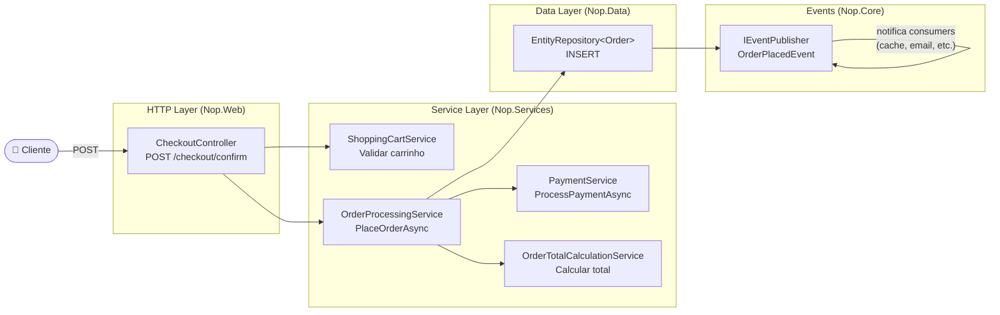
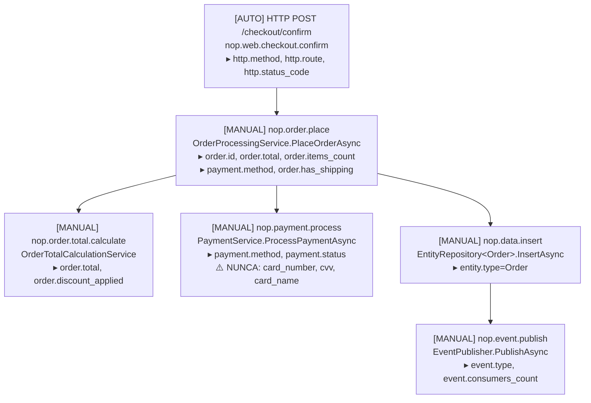
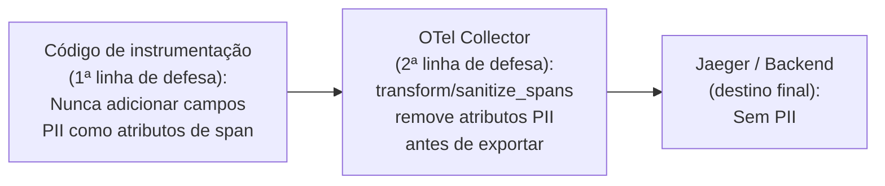
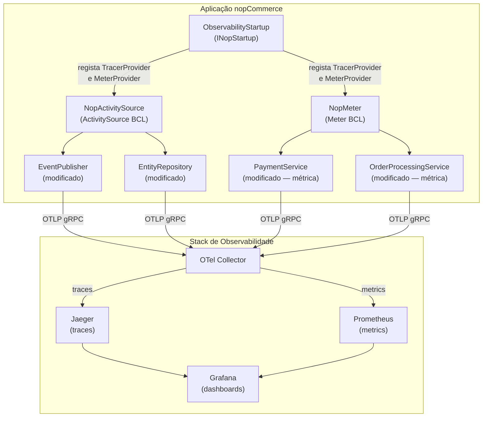
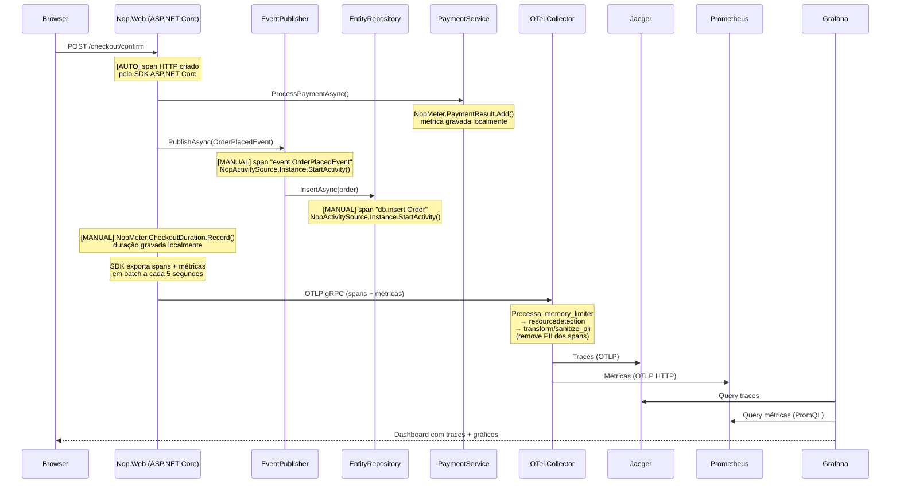

# Tarefa 2 — Selecção do Fluxo a Instrumentar

## Os três fluxos candidatos

| Fluxo | Serviços envolvidos |
|---|---|
| **A** — Cliente faz uma encomenda | ShoppingCart · Order · Payment · Inventory |
| **B** — Cliente pesquisa e vê um produto | Catalogue · Search · Pricing |
| **C** — Admin publica um novo produto | Admin UI · Catalogue · Cache |

---

## Análise por critério de avaliação

### 1. Compreensão arquitectural

O enunciado avalia se a análise "mostra leitura genuína do código, ou é superficial". O fluxo mais complexo demonstra compreensão mais profunda.

| | Fluxo A | Fluxo B | Fluxo C |
|---|---|---|---|
| Nº de serviços coordenados | 4+ | 3 | 2 |
| Complexidade de orquestração | Alta — `OrderProcessingService` chama `PaymentService`, `ShoppingCartService`, `AddressService`, `TaxService`, `ShippingService` | Média | Baixa |
| Demonstra leitura do código | Sim — exige entender como `PlaceOrderAsync` coordena múltiplos serviços | Parcialmente | Pouco |

**Vantagem clara: Fluxo A.**

---

### 2. Qualidade da instrumentação

Um trace tem de "contar a história completa do pedido". Quanto mais etapas distintas, mais rica é a história.

**Fluxo A — o trace conta:**
```
HTTP POST /checkout
  └── ShoppingCartService.GetShoppingCartAsync
  └── OrderProcessingService.PlaceOrderAsync
        └── ValidateBillingAddress
        └── OrderTotalCalculationService.GetShoppingCartTotalAsync
        └── PaymentService.ProcessPaymentAsync
        └── EntityRepository<Order>.InsertAsync
              └── EventPublisher → OrderPlacedEvent → [consumers]
        └── ShipmentService (se aplicável)
```

**Fluxo B — o trace conta:**
```
HTTP GET /search
  └── ProductService.SearchProductsAsync
  └── PriceCalculationService.GetFinalPriceAsync
```

**Fluxo C — o trace conta:**
```
HTTP POST /admin/product/create
  └── ProductService.InsertProductAsync
  └── CacheEventConsumer → invalida cache
```

O Fluxo A tem mais etapas, mais services, mais pontos de falha possíveis — o que torna a história do trace genuinamente informativa para um engenheiro de serviço.

**Vantagem clara: Fluxo A.**

---

### 3. Justificação das métricas *(critério mais diferenciador)*

O enunciado é explícito: *"I added this because it was easy" is not a justification"* e usa o checkout como exemplo de boa métrica: *"This metric would tell an operator that the checkout pipeline is degrading before users start seeing errors."*

**Fluxo A — métricas com valor operacional real:**

| Métrica | Justificação |
|---|---|
| `nop.payment.failures.total` (por método de pagamento) | Se disparar às 2h, o engenheiro sabe imediatamente qual provider de pagamento está a falhar — e pode redirigir tráfego para outro método |
| `nop.checkout.duration` (histograma p50/p95/p99) | Degradação no p99 antes de erros aparecerem é o aviso antecipado que o enunciado pede explicitamente |
| `nop.order.items.total` (distribuição por encomenda) | Detecta anomalias de comportamento (ex: ataque de fraude com encomendas de 1 item em massa) |

**Fluxo B — métricas possíveis:**

| Métrica | Limitação |
|---|---|
| `nop.search.duration` | Latência de pesquisa raramente é crítica às 2h |
| `nop.search.results.count` | Sem acção clara para o engenheiro |
| Cache hit rate | Útil, mas não é uma métrica de negócio |

**Fluxo C — métricas possíveis:**

| Métrica | Limitação |
|---|---|
| `nop.product.publish.duration` | Admin flow — não afecta directamente clientes |
| Cache invalidation count | Infraestrutura, pouco valor de negócio |

**Vantagem decisiva: Fluxo A** — as métricas têm acção clara associada, o que é exactamente o que o enunciado pede.

---

### 4. Exclusão de dados sensíveis (PII)

O enunciado exige explicitamente que *"no emails, payment details or PII in traces or logs"* e menciona `Nop.Services.Orders` e `Nop.Services.Customers` como zonas de atenção.

O `ProcessPaymentRequest` confirmado no código tem em plaintext:
- `CreditCardNumber`
- `CreditCardCvv2`
- `CreditCardName`
- `CreditCardExpireYear` / `CreditCardExpireMonth`

Estes campos existem em plaintext durante a execução de `OrderProcessingService.PlaceOrderAsync` antes de serem encriptados para guardar na base de dados.

| | Fluxo A | Fluxo B | Fluxo C |
|---|---|---|---|
| PII real presente | Sim — dados de cartão, email, morada de facturação | Mínimo — apenas ID de cliente | Não |
| Demonstra sanitização OTel Processor | Sim — necessário e demonstrável | Forçado/artificial | Não aplicável |

O Fluxo A é o único onde o requisito de sanitização de PII é **genuíno e necessário**. Nos outros dois, implementar um OTel Processor de sanitização pareceria artificial porque não há dados sensíveis reais a sanitizar.

**Vantagem decisiva: Fluxo A.**

---

### 5. Abordagem cirúrgica

Todos os fluxos requerem as mesmas alterações de infraestrutura (`ObservabilityStartup`, modificação do `EventPublisher`, `EntityRepository`). Sem diferença relevante aqui.

---

### 6. Clareza do dashboard

O enunciado pede que *"someone who has never seen your code should be able to look at it and understand what is happening in the system."*

- **Fluxo A:** "Quantas encomendas por minuto? Qual a taxa de falha de pagamento? Quanto tempo demora o checkout?" — qualquer pessoa percebe.
- **Fluxo B:** "Quantas pesquisas por segundo? Qual o tempo médio de resposta?" — mais técnico, menos narrativo.
- **Fluxo C:** "Quantos produtos publicados? Tempo de invalidação de cache?" — dificilmente conta uma história interessante.

**Vantagem: Fluxo A.**

---

## Decisão

**Fluxo seleccionado: A — Cliente faz uma encomenda**

É o único fluxo que satisfaz todos os critérios de avaliação de forma genuína e não forçada:
- Complexidade arquitectural suficiente para demonstrar leitura real do código
- Spans com história completa e significativa
- Métricas com valor operacional directo e acção clara associada
- PII real presente que exige sanitização — o OTel Processor tem propósito genuíno
- Dashboard com narrativa de negócio intuitiva



---

## 5. Plano de Instrumentação

### 5.1 Distributed Tracing

#### O que significa "spans from HTTP entry point through service calls to database"

O enunciado pede que o trace cubra três níveis. Para perceber o porquê, é preciso perceber primeiro o que é um trace e o que é um span.

**Um trace é o registo de uma operação de ponta a ponta.** Quando um cliente clica "Confirmar Encomenda", acontecem muitas coisas em sequência. O trace captura tudo isso como uma árvore de spans.

**Um span é uma unidade de trabalho com início e fim.** Tem um nome, uma duração, e atributos (metadados). Spans têm relação pai-filho — o span filho acontece dentro do contexto do pai.

Para o fluxo de encomenda, concretamente:

```
[span] HTTP POST /checkout/confirm          ← nível 1: "entry point" — entrada HTTP
    [span] OrderProcessingService           ← nível 2: "service call"
        [span] PaymentService               ← nível 2: "service call" dentro de outro
        [span] INSERT INTO Orders           ← nível 3: "database"
```

Os três níveis que o enunciado exige:

1. **HTTP entry point** — o momento em que o pedido chega ao servidor. Quem chamou? Que rota? Demorou quanto no total?
2. **Service calls** — o que aconteceu dentro da aplicação. Que serviços foram invocados? Qual deles demorou mais? Qual falhou?
3. **Database** — o que foi à base de dados. Que operações? Quanto tempo passou em IO?

**Porquê é que isto é valioso?** Sem tracing, se uma encomenda demora 5 segundos, não se sabe se o tempo foi no pagamento, no cálculo de totais, ou na base de dados. Com o trace completo, vê-se exactamente onde o tempo foi gasto — é como ter um profiler em produção.

> O "distributed" no nome vem de sistemas com vários serviços em máquinas diferentes (como o opentelemetry-demo). No nopCommerce, que é um monolito, o trace é tecnicamente local — mas o princípio e o valor são os mesmos.

---

#### O que é e o que se pretende

Distributed tracing regista o percurso completo de um pedido como uma árvore de **spans**. Cada span representa uma unidade de trabalho com início, fim, duração e atributos. O conjunto de spans ligados pelo mesmo `trace_id` forma um trace — a história completa de "o que aconteceu quando este cliente tentou fazer uma encomenda".

O objectivo aqui não é ter spans em todo o lado, mas sim ter spans **nos pontos certos** — aqueles que revelam onde o tempo é gasto e onde os erros ocorrem.

#### Origem dos spans: automáticos vs. manuais

O OpenTelemetry para ASP.NET Core já fornece instrumentação automática para:
- **HTTP entry** (`AddAspNetCoreInstrumentation`) — cria um span para cada pedido HTTP de entrada com método, rota, status code e duração. Não é necessário escrever código.
- **HTTP client** (`AddHttpClientInstrumentation`) — cria spans para chamadas HTTP de saída (ex: para payment providers externos).

O que a instrumentação automática **não cobre**:
- Chamadas entre serviços internos (são chamadas de método, não HTTP)
- Operações na base de dados via linq2db
- Lógica de negócio específica do domínio

Para esses casos, é necessário criar spans manualmente com um `ActivitySource`.

#### Mapa de spans do fluxo de encomenda



#### Onde criar cada span e porquê

| Span | Onde no código | Porquê aqui e não noutro sítio |
|---|---|---|
| HTTP entry | Auto — `AddAspNetCoreInstrumentation()` | ASP.NET Core já fornece, zero custo |
| `nop.order.place` | `OrderProcessingService.PlaceOrderAsync` | É o orquestrador central do fluxo — o span pai que agrupa todos os outros |
| `nop.order.total.calculate` | `OrderTotalCalculationService` | Cálculo de totais é frequentemente lento e envolve descontos/impostos — útil isolar a sua duração |
| `nop.payment.process` | `PaymentService.ProcessPaymentAsync` | Chamada a provider externo — o ponto com maior variabilidade de latência e o mais propenso a erros |
| `nop.data.insert` | `EntityRepository<T>.InsertAsync` | Único ponto de acesso à BD — modificação cirúrgica numa só classe genérica cobre todas as entidades |
| `nop.event.publish` | `EventPublisher.PublishAsync` | Central de eventos — permite ver quais eventos foram disparados e quantos consumers foram notificados |

#### Atributos seguros para os spans

Atributos que **podem** ser adicionados aos spans sem risco de PII:

```
order.id                → int    — identificador opaco, não é PII
order.total             → decimal — valor monetário, não identifica uma pessoa
order.items_count       → int    — quantidade de itens no carrinho
order.has_shipping      → bool   — encomenda requer envio físico
order.status            → string — "Pending", "Processing", etc.
payment.method          → string — "Payments.PayPalCommerce", "Payments.CheckMoneyOrder"
payment.status          → string — "success" | "failure"
event.type              → string — nome do tipo de evento publicado
event.consumers_count   → int    — número de consumers invocados
entity.type             → string — "Order", "OrderItem", etc.
```

Atributos que **nunca** devem aparecer em spans:

```
❌ customer.email
❌ payment.card_number      (CreditCardNumber em ProcessPaymentRequest)
❌ payment.card_cvv         (CreditCardCvv2 em ProcessPaymentRequest)
❌ payment.card_name        (CreditCardName em ProcessPaymentRequest)
❌ billing.address.*        (morada de facturação)
❌ shipping.address.*       (morada de envio)
❌ customer.first_name / customer.last_name
```

#### ActivitySource — ponto de registo

Toda a instrumentação manual usa um único `ActivitySource` registado centralmente:

```csharp
// Registado na ObservabilityStartup via INopStartup
public static class NopActivitySource
{
    public static readonly ActivitySource Instance =
        new("NopCommerce.Checkout", "1.0.0");
}
```

O SDK OTel subscreve este source em `.AddSource("NopCommerce.Checkout")` durante o registo do `TracerProvider`.

---

### 5.2 Métricas Personalizadas

#### O que significa "genuine operational insight"

O enunciado rejeita métricas que apenas respondem a *"quantos pedidos?"* porque o ASP.NET Core já dá isso de graça. O que ele quer são métricas que respondam a *"o sistema está saudável?"* de uma forma que um engenheiro consiga **agir** directamente.

O teste proposto pelo enunciado é: *"se esta métrica disparar às 2h da manhã, o engenheiro de serviço sabe o que fazer?"*

Há uma diferença fundamental entre:
- **Métrica de volume** → "recebemos 500 pedidos por minuto" → não diz nada sobre saúde, não tem acção associada
- **Métrica operacional** → "30% dos pagamentos via PayPal estão a falhar" → o engenheiro sabe exactamente o que fazer

#### Princípio de selecção

A instrumentação automática de ASP.NET Core já fornece gratuitamente:
- Número de pedidos HTTP por rota e status code
- Duração dos pedidos HTTP (p50, p95, p99)
- Taxa de erros HTTP (4xx, 5xx)

As métricas personalizadas têm de acrescentar algo que estas **não conseguem dizer**.

---

#### Métrica 1 — `nop.payment.result` (Counter)

**Tipo:** Counter (sempre a incrementar)
**Dimensões:** `payment.method`, `payment.status`

```
nop.payment.result{payment.method="Payments.PayPalCommerce", payment.status="failure"} += 1
nop.payment.result{payment.method="Payments.CheckMoneyOrder", payment.status="success"} += 1
```

**Justificação:**

**Porque não é "apenas request count":** a contagem de pedidos HTTP diz quantos pedidos chegaram ao servidor. Esta métrica diz quantos *pagamentos* tiveram sucesso ou falharam. São coisas diferentes — um pagamento falhado pode devolver HTTP 200 com uma mensagem de erro no corpo da resposta. A taxa de erros HTTP não vê isso. Esta métrica vê.

**A dimensão `payment.method` é o que a torna realmente útil.** Sem ela, se 10% dos pagamentos falham, não se sabe porquê. Com ela:

```
payment.method=PayPalCommerce   payment.status=failure → 47 ocorrências  ← problema aqui
payment.method=CheckMoneyOrder  payment.status=failure →  0 ocorrências
payment.method=PayPalCommerce   payment.status=success →  3 ocorrências
```

Se às 2h da manhã este padrão aparecer, o engenheiro sabe imediatamente:
1. O problema é específico do PayPal, não do sistema nopCommerce
2. Pode desactivar o PayPal como método de pagamento temporariamente
3. Pode contactar o suporte do PayPal com o timestamp exacto de início do problema

Sem esta métrica, o único sinal seria clientes a reportar falhas ou uma análise manual de logs.

**Onde implementar:** `PaymentService.ProcessPaymentAsync` — após receber o `ProcessPaymentResult`, incrementar o counter com o resultado e o nome do método de pagamento (que está em `processPaymentRequest.PaymentMethodSystemName`, um campo seguro/não-PII).

---

#### Métrica 2 — `nop.checkout.duration` (Histogram)

**Tipo:** Histogram
**Dimensões:** `payment.method`, `order.has_shipping`
**Unidade:** milissegundos
**Percentis relevantes:** p50, p95, p99

```
nop.checkout.duration{payment.method="Payments.PayPalCommerce", order.has_shipping="true"} = 1240ms
nop.checkout.duration{payment.method="Payments.CheckMoneyOrder", order.has_shipping="false"} = 180ms
```

**Justificação:**

**Porque não é "apenas HTTP duration":** o ASP.NET Core já mede a duração total do pedido HTTP — mas esse número inclui rendering da página, serialização JSON, middleware de autenticação, e muito mais. Esta métrica mede apenas o tempo da lógica de negócio pura (`OrderProcessingService.PlaceOrderAsync`). São coisas diferentes e o problema pode estar em qualquer uma delas.

**O que a torna operacionalmente útil é a combinação de histograma + dimensão `payment.method`.** Um histograma dá percentis — p50, p95, p99. A diferença entre eles é informativa:
- p50 estável, p99 a subir → alguns pagamentos estão muito lentos mas a maioria está normal. Provavelmente um timeout intermitente no provider.
- p50 e p99 ambos a subir → o sistema todo está lento. Provavelmente a base de dados.

A dimensão `payment.method` permite isolar o problema: um p99 a subir apenas para `payment.method=PayPalCommerce` enquanto outros métodos estão estáveis indica latência no API externo do PayPal — não um problema no nopCommerce. Sem esta dimensão, o engenheiro veria "checkout está lento" mas não saberia onde.

A dimensão `order.has_shipping` permite separar ordens digitais (rápidas) de físicas (que envolvem cálculo de taxas de envio, potencialmente chamadas a APIs externos de shipping).

**Esta métrica detecta degradação do pipeline *antes* de os utilizadores verem erros.** Um timeout de pagamento que demora 29 segundos não causa um erro HTTP — o utilizador simplesmente espera. A taxa de erros está a zero. Mas o p99 desta métrica está a 29 000ms em vez dos habituais 800ms — esse é o aviso que permite ao engenheiro agir antes que os utilizadores comecem a abandonar o checkout.

**Onde implementar:** Início e fim de `OrderProcessingService.PlaceOrderAsync` — medir a duração total desta operação e registar no histograma com as dimensões relevantes.

---

#### Sumário das métricas

| | `nop.payment.result` | `nop.checkout.duration` |
|---|---|---|
| **Tipo** | Counter | Histogram |
| **Responde a** | "O pagamento está a funcionar?" | "O checkout está rápido?" |
| **Dimensões-chave** | `payment.method`, `payment.status` | `payment.method`, `order.has_shipping` |
| **Acção às 2h** | Desactivar provider com falhas | Identificar e isolar o passo lento |
| **O que a métrica HTTP não cobre** | Falhas de negócio com HTTP 200 | Latência específica da lógica de negócio |

Juntas, estas duas métricas respondem à pergunta essencial de saúde do pipeline de checkout: **está disponível? está rápido?**

---

### 5.3 Exclusão de Dados Sensíveis (PII)

#### O problema concreto neste fluxo

O `ProcessPaymentRequest` — que circula dentro de `OrderProcessingService.PlaceOrderAsync` — contém os seguintes campos em **plaintext** antes de serem encriptados para guardar na base de dados:

```csharp
// ProcessPaymentRequest.cs — campos PII confirmados
public string CreditCardNumber   { get; set; }  // ex: "4111111111111111"
public string CreditCardCvv2     { get; set; }  // ex: "123"
public string CreditCardName     { get; set; }  // ex: "João Silva"
public int    CreditCardExpireYear  { get; set; }
public int    CreditCardExpireMonth { get; set; }
```

Adicionalmente, `Customer` tem `Email`, e os objectos `Address` têm nome, morada, telefone. Estes objectos existem no contexto de execução do `OrderProcessingService` durante toda a duração do span.

#### Estratégia: dois níveis de defesa

A abordagem não é tentar lembrar de excluir campos em cada ponto de instrumentação — é **nunca adicionar PII** no código, e ter o **Collector como rede de segurança** para o que possa escapar.



**Por que dois níveis?**

O `EventPublisher` publica eventos que contêm entidades completas — um `EntityInsertedEvent<Order>` tem o objecto `Order` com `BillingAddressId`, `CustomerId`, etc. Se um consumer ou o próprio EventPublisher instrumentado serializar esse evento descuidadamente, PII pode surgir. O Collector como segunda linha de defesa garante que mesmo erros de instrumentação futuros não chegam ao backend de traces.

#### Nível 1 — Disciplina no código

Regra: os atributos de span apenas registam **identificadores opacos e dados operacionais** — nunca dados de pessoas.

```
✅ order.id              (int — identificador da BD, não identifica uma pessoa isoladamente)
✅ order.total           (decimal — valor monetário)
✅ payment.method        (string — nome do plugin, não é dado pessoal)
✅ payment.status        ("success" | "failure")
✅ order.items_count     (int)

❌ customer.email        → usar customer.id (int) se necessário referenciar o cliente
❌ payment.card_number   → nunca expor, nem mascarado
❌ billing.address.*     → nunca expor endereços
❌ customer.name         → nunca expor nomes
```

#### Nível 2 — OTel Collector Processor

Configuração do `transform/sanitize_spans` processor no OTel Collector, seguindo o padrão do `opentelemetry-demo/src/otel-collector/otelcol-config.yml`:

```yaml
processors:
  transform/sanitize_pii:
    error_mode: ignore
    trace_statements:
      - context: span
        statements:
          # Remover campos PII que possam ter entrado por engano
          - delete_key(attributes, "customer.email")
          - delete_key(attributes, "payment.card_number")
          - delete_key(attributes, "payment.card_cvv")
          - delete_key(attributes, "payment.card_name")
          - delete_key(attributes, "billing.address")
          - delete_key(attributes, "shipping.address")
          - delete_key(attributes, "customer.name")
          - delete_key(attributes, "customer.first_name")
          - delete_key(attributes, "customer.last_name")
          # Redactar URLs que possam conter tokens ou emails
          - replace_pattern(attributes["http.url"], "email=[^&]*", "email=REDACTED")
          - replace_pattern(attributes["http.url"], "token=[^&]*", "token=REDACTED")

service:
  pipelines:
    traces:
      receivers:  [otlp]
      processors: [memory_limiter, resourcedetection, transform/sanitize_pii]
      exporters:  [otlp_grpc/jaeger]
```

**Porque este processor e não exclusões caso a caso no código C#:**

A solução do Collector é **centralizada e incondicional** — age sobre todos os spans de todos os serviços antes de qualquer exportação, independentemente de quem os criou ou de como foram instrumentados. Num sistema com 30+ plugins que podem criar spans, garantir que cada um exclui os campos certos é impraticável. Um processor no Collector garante isso de forma automática.

---

### 5.4 Visão de conjunto — o que é tocado e o que não é

```
Ficheiros NOVOS (zero impacto em código existente):
  ├── Nop.Web.Framework/Infrastructure/ObservabilityStartup.cs  — registo OTel SDK
  ├── Nop.Core/Observability/NopActivitySource.cs               — ActivitySource central
  ├── Nop.Core/Observability/NopMeter.cs                        — Meter e instrumentos
  └── observability/otelcol-config.yml                          — OTel Collector config

Ficheiros MODIFICADOS — tracing (alterações cirúrgicas, só infra):
  ├── Nop.Services/Events/EventPublisher.cs   — +ActivitySource em PublishAsync (~8 linhas)
  └── Nop.Data/EntityRepository.cs           — +ActivitySource em Insert/Update/Delete (~5 linhas cada)

Ficheiros MODIFICADOS — métricas (alterações cirúrgicas, só registo de número):
  ├── Nop.Services/Payments/PaymentService.cs         — +1 linha de métrica em ProcessPaymentAsync
  └── Nop.Services/Orders/OrderProcessingService.cs  — +3 linhas de métrica em PlaceOrderAsync

Ficheiros NÃO TOCADOS:
  ├── ShoppingCartService.cs          — coberto por HTTP auto-instrumentation
  ├── Todos os controllers e views    — sem alterações
  └── Todos os plugins                — sem alterações
```

> **Nota sobre PaymentService e OrderProcessingService:** estes ficheiros são tocados apenas para registar métricas — uma ou duas linhas que gravam um número, sem lógica de negócio. Não são adicionados spans de tracing aqui porque o EventPublisher e o EntityRepository já cobrem os eventos correspondentes. A distinção é importante: tracing vai para infra, métricas vão para os dois serviços onde a informação de negócio necessária (resultado do pagamento, duração do pipeline) está naturalmente disponível.

A instrumentação segue o princípio do enunciado: **alterações mínimas, bem colocadas, o mais próximo possível da fronteira de infraestrutura** — não na lógica de negócio.

---

## 6. Guia de Implementação

### 6.1 Visão Geral e Ordem de Implementação

Antes de tocar em qualquer código, é útil perceber como todas as peças se encaixam:



**Ordem recomendada:**
1. Adicionar pacotes NuGet
2. Criar `NopActivitySource` e `NopMeter` (Nop.Core)
3. Criar `ObservabilityStartup` (Nop.Web.Framework)
4. Modificar `EventPublisher` (tracing)
5. Modificar `EntityRepository` (tracing)
6. Modificar `PaymentService` (métrica 1)
7. Modificar `OrderProcessingService` (métrica 2)
8. Configurar OTel Collector
9. Montar stack docker-compose

---

### 6.2 Dependências NuGet

Os pacotes do OTel SDK apenas são necessários no projecto onde o `TracerProvider`/`MeterProvider` é configurado — `Nop.Web.Framework`. O `ActivitySource` e o `Meter` são parte do BCL do .NET (sem NuGet).

Adicionar ao `Nop.Web.Framework.csproj`:

```xml
<!-- OTel SDK core -->
<PackageReference Include="OpenTelemetry" Version="1.9.0" />
<PackageReference Include="OpenTelemetry.Extensions.Hosting" Version="1.9.0" />

<!-- Instrumentação automática -->
<PackageReference Include="OpenTelemetry.Instrumentation.AspNetCore" Version="1.9.0" />
<PackageReference Include="OpenTelemetry.Instrumentation.Http" Version="1.9.0" />

<!-- Exportador OTLP (para enviar ao Collector) -->
<PackageReference Include="OpenTelemetry.Exporter.OpenTelemetryProtocol" Version="1.9.0" />
```

> **Porquê só em `Nop.Web.Framework`?** Porque é aqui que o `INopStartup` é implementado e onde os serviços são registados. Os outros projectos (`Nop.Core`, `Nop.Data`, `Nop.Services`) usam apenas `System.Diagnostics.ActivitySource` e `System.Diagnostics.Metrics.Meter`, que fazem parte do .NET base — sem dependências externas.

---

### 6.3 Definição Central — ActivitySource e Meter

Estas duas classes são o **ponto de definição único** de toda a instrumentação. Ficam em `Nop.Core` para que qualquer camada as possa usar sem dependências cíclicas.

#### `NopActivitySource.cs` — para tracing

```csharp
// Nop.Core/Observability/NopActivitySource.cs
using System.Diagnostics;

namespace Nop.Core.Observability;

public static class NopActivitySource
{
    public const string Name = "NopCommerce.Checkout";
    public const string Version = "1.0.0";

    // A instância estática do ActivitySource
    // ActivitySource é thread-safe e pode ser estático
    public static readonly ActivitySource Instance = new(Name, Version);
}
```

**Porquê um ActivitySource estático?**
O `ActivitySource` é o "nome do instrumento" — é o identificador que o OTel SDK usa para saber que spans deve capturar. Ao ser estático, está disponível em qualquer ponto do código sem injecção de dependências. O SDK subscreve-o pelo nome durante o registo do `TracerProvider`.

#### `NopMeter.cs` — para métricas

```csharp
// Nop.Core/Observability/NopMeter.cs
using System.Diagnostics.Metrics;

namespace Nop.Core.Observability;

public static class NopMeter
{
    public const string Name = "NopCommerce.Checkout";
    public const string Version = "1.0.0";

    private static readonly Meter _meter = new(Name, Version);

    // Métrica 1: resultado de pagamentos
    // Counter — valor só cresce, representa ocorrências cumulativas
    public static readonly Counter<long> PaymentResult =
        _meter.CreateCounter<long>(
            name: "nop.payment.result",
            unit: "payments",
            description: "Number of payment attempts, tagged by method and outcome");

    // Métrica 2: duração do pipeline de checkout
    // Histogram — distribui valores em buckets, permite calcular percentis
    public static readonly Histogram<double> CheckoutDuration =
        _meter.CreateHistogram<double>(
            name: "nop.checkout.duration",
            unit: "ms",
            description: "Duration of OrderProcessingService.PlaceOrderAsync in milliseconds");
}
```

**Porquê Counter para pagamentos e Histogram para duração?**

- **Counter** — adequado para contar eventos que acontecem (pagamentos processados). Só cresce. O Prometheus deriva a taxa de crescimento (`rate()`) para obter "pagamentos por segundo". É o instrumento certo para "quantas vezes aconteceu X".

- **Histogram** — adequado para medir magnitudes que variam (duração em ms). Distribui os valores em buckets e permite calcular percentis (p50, p95, p99). É o instrumento certo para "quanto tempo demora X, e qual é a distribuição".

---

### 6.4 ObservabilityStartup — Registo do OTel SDK

Esta classe é o único lugar onde o OTel SDK é configurado. Implementa `INopStartup`, pelo que é descoberta e executada automaticamente durante o startup sem alterar nenhum ficheiro existente.

```csharp
// Nop.Web.Framework/Infrastructure/ObservabilityStartup.cs
using Microsoft.AspNetCore.Builder;
using Microsoft.Extensions.Configuration;
using Microsoft.Extensions.DependencyInjection;
using Nop.Core.Infrastructure;
using Nop.Core.Observability;
using OpenTelemetry.Exporter;
using OpenTelemetry.Metrics;
using OpenTelemetry.Resources;
using OpenTelemetry.Trace;

namespace Nop.Web.Framework.Infrastructure;

public class ObservabilityStartup : INopStartup
{
    public void ConfigureServices(IServiceCollection services, IConfiguration configuration)
    {
        // Endpoint do OTel Collector — lido da configuração
        // Por defeito aponta para o Collector local em Docker
        var otlpEndpoint = configuration["OpenTelemetry:OtlpEndpoint"]
                           ?? "http://otel-collector:4317";

        services.AddOpenTelemetry()

            // Recurso: metadados que identificam esta instância do serviço
            // Aparece em todos os spans e métricas como atributos de contexto
            .ConfigureResource(resource => resource
                .AddService(
                    serviceName: "nopcommerce",
                    serviceVersion: "5.0.0")
                .AddAttributes(new Dictionary<string, object>
                {
                    ["deployment.environment"] = configuration["ASPNETCORE_ENVIRONMENT"] ?? "Production"
                }))

            // --- TRACING ---
            .WithTracing(tracing => tracing

                // Subscreve o ActivitySource que criámos — só spans deste source são capturados
                .AddSource(NopActivitySource.Name)

                // Instrumentação automática: cria spans para cada pedido HTTP recebido
                // Captura: http.method, http.route, http.status_code, duração
                .AddAspNetCoreInstrumentation(options =>
                {
                    // Excluir pedidos a endpoints de healthcheck — não têm valor nos traces
                    options.Filter = context =>
                        !context.Request.Path.StartsWithSegments("/health");
                })

                // Instrumentação automática: cria spans para chamadas HTTP de saída
                // Captura chamadas a payment providers externos (PayPal, etc.)
                .AddHttpClientInstrumentation()

                // Exporta para o OTel Collector via gRPC (protocolo OTLP)
                .AddOtlpExporter(options =>
                {
                    options.Endpoint = new Uri(otlpEndpoint);
                    options.Protocol = OtlpExportProtocol.Grpc;
                }))

            // --- MÉTRICAS ---
            .WithMetrics(metrics => metrics

                // Subscreve o Meter que criámos
                .AddMeter(NopMeter.Name)

                // Métricas automáticas de HTTP (request count, duration, error rate)
                .AddAspNetCoreInstrumentation()

                // Métricas do runtime .NET (GC, thread pool, memória)
                .AddRuntimeInstrumentation()

                // Exemplars: liga pontos num gráfico de métricas ao trace correspondente
                // Permite navegar de "este spike" directamente para o trace que o causou
                .SetExemplarFilter(ExemplarFilterType.TraceBased)

                // Exporta para o OTel Collector via gRPC
                .AddOtlpExporter(options =>
                {
                    options.Endpoint = new Uri(otlpEndpoint);
                    options.Protocol = OtlpExportProtocol.Grpc;
                }));
    }

    public void Configure(IApplicationBuilder application) { }

    // Order = 10: executa antes do NopStartup (Order = 2000)
    // O OTel deve estar registado antes de qualquer serviço que o use
    public int Order => 10;
}
```

**Pontos importantes desta configuração:**

- **`AddSource(NopActivitySource.Name)`** — sem isto, os spans criados com `NopActivitySource.Instance` são ignorados. É o "subscrito" que liga o código de instrumentação ao pipeline do SDK.
- **`SetExemplarFilter(TraceBased)`** — quando existe um trace activo no momento em que uma métrica é registada, guarda o `trace_id` e `span_id` como exemplar. No Grafana, isto permite clicar num ponto do gráfico e ir directamente ao trace correspondente.
- **`Order = 10`** — o `NopStartup` tem `Order = 2000`. Ao registar o OTel primeiro, garantimos que o `TracerProvider` está disponível antes de qualquer serviço começar a processar pedidos.

---

### 6.5 Instrumentação de Tracing — EventPublisher

O `EventPublisher.PublishAsync` é modificado para criar um span por cada evento publicado. É a única alteração necessária para ter visibilidade sobre toda a actividade de domínio do sistema.

```csharp
// Nop.Services/Events/EventPublisher.cs
// ANTES (código original):
public virtual async Task PublishAsync<TEvent>(TEvent @event)
{
    var consumers = EngineContext.Current.ResolveAll<IConsumer<TEvent>>().ToList();
    foreach (var consumer in consumers)
    {
        try
        {
            await consumer.HandleEventAsync(@event);
            if (@event is IStopProcessingEvent { StopProcessing: true })
                break;
        }
        catch (Exception exception)
        {
            try
            {
                var logger = EngineContext.Current.Resolve<ILogger>();
                await logger?.ErrorAsync(exception.Message, exception);
            }
            catch { }
        }
    }
}

// DEPOIS (com instrumentação):
public virtual async Task PublishAsync<TEvent>(TEvent @event)
{
    // StartActivity cria um span filho do span activo no momento (contexto propagado automaticamente)
    // Se não existir span activo (ex: background task), cria um span raiz
    // O 'using' garante que o span é fechado quando o método termina — mesmo em caso de excepção
    using var activity = NopActivitySource.Instance.StartActivity(
        name: $"event {typeof(TEvent).Name}",
        kind: ActivityKind.Internal);  // Internal = operação interna, não uma chamada de rede

    var consumers = EngineContext.Current.ResolveAll<IConsumer<TEvent>>().ToList();

    // Atributos seguros — descrevem o evento sem expor PII
    activity?.SetTag("event.type", typeof(TEvent).Name);
    activity?.SetTag("event.consumers_count", consumers.Count);

    foreach (var consumer in consumers)
    {
        try
        {
            await consumer.HandleEventAsync(@event);
            if (@event is IStopProcessingEvent { StopProcessing: true })
                break;
        }
        catch (Exception exception)
        {
            // Marca o span como erro — visível no Jaeger como span vermelho
            activity?.SetStatus(ActivityStatusCode.Error, exception.Message);
            activity?.SetTag("error.type", exception.GetType().Name);

            try
            {
                var logger = EngineContext.Current.Resolve<ILogger>();
                await logger?.ErrorAsync(exception.Message, exception);
            }
            catch { }
        }
    }
}
```

**Porquê `ActivityKind.Internal` e não `Client` ou `Server`?**

O OpenTelemetry define kinds semânticos para spans:
- `Server` — recebe um pedido de rede (ex: HTTP endpoint)
- `Client` — faz um pedido de rede (ex: chamada HTTP a API externa)
- `Internal` — operação interna sem comunicação de rede

O `EventPublisher` é uma chamada de método in-process — não há rede envolvida. `Internal` é o kind correcto.

**Porquê `activity?.SetTag(...)` com o operador `?.`?**

`StartActivity` pode retornar `null` se o `ActivitySource` não tiver subscritores activos (ex: ambiente de testes sem OTel configurado). O operador `?.` garante que o código não lança `NullReferenceException` nesses casos — a instrumentação é transparente quando não está configurada.

---

### 6.6 Instrumentação de Tracing — EntityRepository

O `EntityRepository<T>` é modificado nos três métodos CRUD principais. Como é uma classe genérica, uma única modificação cobre todas as entidades do sistema.

```csharp
// Nop.Data/EntityRepository.cs
// Apenas os métodos Insert, Update, Delete são modificados
// Os métodos de leitura (GetById, GetAll, etc.) não são instrumentados
// para evitar ruído — leituras são muito mais frequentes e menos informativas

// ANTES — InsertAsync (simplificado):
public virtual async Task InsertAsync(TEntity entity, bool publishEvent = true)
{
    ArgumentNullException.ThrowIfNull(entity);
    await _dataProvider.InsertEntityAsync(entity);
    if (publishEvent)
        await _eventPublisher.EntityInsertedAsync(entity);
}

// DEPOIS — InsertAsync com span:
public virtual async Task InsertAsync(TEntity entity, bool publishEvent = true)
{
    ArgumentNullException.ThrowIfNull(entity);

    // db.insert é a convenção de naming para operações de base de dados
    // Segue o padrão semântico do OTel: "db.<operation> <entity>"
    using var activity = NopActivitySource.Instance.StartActivity(
        name: $"db.insert {typeof(TEntity).Name}",
        kind: ActivityKind.Client);  // Client = operação que vai buscar dados a um sistema externo (BD)

    activity?.SetTag("db.operation", "INSERT");
    activity?.SetTag("db.entity_type", typeof(TEntity).Name);
    // NÃO adicionar o ID da entidade se for uma entidade de cliente/pagamento
    // para evitar ligação inadvertida a PII

    try
    {
        await _dataProvider.InsertEntityAsync(entity);
        if (publishEvent)
            await _eventPublisher.EntityInsertedAsync(entity);
    }
    catch (Exception ex)
    {
        activity?.SetStatus(ActivityStatusCode.Error, ex.Message);
        activity?.SetTag("error.type", ex.GetType().Name);
        throw; // re-throw — não engolir a excepção
    }
}

// O mesmo padrão para UpdateAsync e DeleteAsync,
// mudando apenas o nome ("db.update", "db.delete") e o tag "db.operation"
```

**Porquê `ActivityKind.Client` para operações de BD?**

Pela convenção semântica do OTel, `Client` indica que o span representa uma chamada a um sistema externo (base de dados, cache, API). Jaeger e Grafana usam este kind para apresentar visualmente a operação como uma chamada de saída — o que é conceptualmente correcto para uma query à BD.

**Porquê não instrumentar leituras (`GetById`, `GetAll`, etc.)?**

Num sistema e-commerce, as leituras são ordens de magnitude mais frequentes do que as escritas. Instrumentar cada `SELECT` geraria um volume enorme de spans com pouco valor informativo — o que se chama "noise". A regra prática: instrumentar as operações que **mudam estado** (writes) e operações de leitura apenas em caminhos críticos específicos se necessário.

---

### 6.7 Métricas — PaymentService

Uma linha de registo de métrica após receber o resultado do processamento de pagamento.

```csharp
// Nop.Services/Payments/PaymentService.cs
// Apenas a secção relevante de ProcessPaymentAsync

public virtual async Task<ProcessPaymentResult> ProcessPaymentAsync(
    ProcessPaymentRequest processPaymentRequest)
{
    // ... código existente sem alteração ...
    var paymentMethod = await LoadPaymentMethodBySystemNameAsync(
        processPaymentRequest.PaymentMethodSystemName);

    // ... código existente sem alteração ...
    var result = await paymentMethod.ProcessPaymentAsync(processPaymentRequest);

    // ADIÇÃO: registo da métrica após obter o resultado
    // PaymentMethodSystemName é seguro — é o nome do plugin, não dados do cliente
    // ex: "Payments.PayPalCommerce", "Payments.CheckMoneyOrder"
    NopMeter.PaymentResult.Add(1,
        new KeyValuePair<string, object?>("payment.method",
            processPaymentRequest.PaymentMethodSystemName),
        new KeyValuePair<string, object?>("payment.status",
            result.Success ? "success" : "failure"));

    return result;
}
```

**Porque exatamente aqui e não noutro sítio?**

Este é o único ponto no código onde:
1. Se sabe qual o método de pagamento (`PaymentMethodSystemName`)
2. Se sabe se o resultado foi sucesso ou falha (`result.Success`)
3. Ambas as informações estão disponíveis simultaneamente

Qualquer outro ponto (ex: `OrderProcessingService`) ou não tem acesso ao resultado detalhado do pagamento, ou não tem o nome do provider de forma directa.

---

### 6.8 Métricas — OrderProcessingService

Três linhas para medir a duração do pipeline completo de colocação de encomenda.

```csharp
// Nop.Services/Orders/OrderProcessingService.cs
// Apenas a secção relevante de PlaceOrderAsync

public virtual async Task<PlaceOrderResult> PlaceOrderAsync(
    ProcessPaymentRequest processPaymentRequest)
{
    ArgumentNullException.ThrowIfNull(processPaymentRequest);

    // ADIÇÃO: iniciar cronómetro antes da lógica de negócio
    var stopwatch = Stopwatch.StartNew();

    // ... todo o código existente sem alteração ...
    var details = await PreparePlaceOrderDetailsAsync(processPaymentRequest);
    // ... etc ...
    var result = new PlaceOrderResult { PlacedOrder = order };

    // ADIÇÃO: registar duração e dimensões no histograma
    // Executado independentemente de sucesso ou falha
    stopwatch.Stop();
    NopMeter.CheckoutDuration.Record(
        value: stopwatch.Elapsed.TotalMilliseconds,
        new KeyValuePair<string, object?>("payment.method",
            processPaymentRequest.PaymentMethodSystemName),
        new KeyValuePair<string, object?>("order.has_shipping",
            details?.ShippingRequired.ToString().ToLower() ?? "unknown"));

    return result;
}
```

**Porquê `Stopwatch` em vez de medir dentro do span de OTel?**

O span de OTel criado no `EventPublisher` e no `EntityRepository` captura a duração dessas operações individuais. Esta métrica captura a duração **total** do método `PlaceOrderAsync` — que inclui validações, cálculo de totais, chamada ao PaymentService, gravação na BD, e publicação de eventos. É uma medida diferente e complementar.

Usar `Stopwatch` directamente é mais simples e não requer um span adicional neste método — o span do `ActivitySource` seria redundante dado que o pai HTTP já existe.

---

### 6.9 OTel Collector — Configuração Completa

O OTel Collector é o intermediário entre a aplicação e os backends (Jaeger, Prometheus). Recebe telemetria via OTLP, processa (incluindo sanitização de PII), e exporta para os destinos.

```yaml
# observability/otelcol-config.yml

receivers:
  otlp:
    protocols:
      grpc:
        endpoint: 0.0.0.0:4317   # porta gRPC — usada pela aplicação
      http:
        endpoint: 0.0.0.0:4318   # porta HTTP — alternativa mais simples para debug

processors:
  # Limita uso de memória — evita que o Collector fique sem memória sob carga
  memory_limiter:
    check_interval: 1s
    limit_percentage: 80
    spike_limit_percentage: 25

  # Detecta atributos do ambiente automaticamente (hostname, OS, container ID)
  # Enriquece todos os spans e métricas com contexto de infraestrutura
  resourcedetection:
    detectors: [env, docker, system]
    timeout: 5s

  # Sanitização de PII — remove atributos sensíveis antes de exportar
  # error_mode: ignore — se uma instrução OTTL falhar, continua as restantes
  transform/sanitize_pii:
    error_mode: ignore
    trace_statements:
      - context: span
        statements:
          - delete_key(attributes, "customer.email")
          - delete_key(attributes, "payment.card_number")
          - delete_key(attributes, "payment.card_cvv")
          - delete_key(attributes, "payment.card_name")
          - delete_key(attributes, "billing.address")
          - delete_key(attributes, "shipping.address")
          - delete_key(attributes, "customer.name")
          - delete_key(attributes, "customer.first_name")
          - delete_key(attributes, "customer.last_name")
          - replace_pattern(attributes["http.url"], "email=[^&]*", "email=REDACTED")
          - replace_pattern(attributes["http.url"], "token=[^&]*", "token=REDACTED")

exporters:
  # Envia traces para o Jaeger via OTLP gRPC
  otlp/jaeger:
    endpoint: jaeger:4317
    tls:
      insecure: true   # OK em ambiente local; em produção usar TLS

  # Envia métricas para o Prometheus via OTLP HTTP
  otlphttp/prometheus:
    endpoint: http://prometheus:9090/api/v1/otlp
    tls:
      insecure: true

  # Output de debug no terminal do Collector (útil durante desenvolvimento)
  debug:
    verbosity: basic

service:
  pipelines:
    # Pipeline de traces: recebe → processa → exporta para Jaeger
    traces:
      receivers:  [otlp]
      processors: [memory_limiter, resourcedetection, transform/sanitize_pii]
      exporters:  [otlp/jaeger, debug]

    # Pipeline de métricas: recebe → processa → exporta para Prometheus
    metrics:
      receivers:  [otlp]
      processors: [memory_limiter, resourcedetection]
      exporters:  [otlphttp/prometheus, debug]
```

**Porquê um Collector em vez de exportar directamente para Jaeger/Prometheus?**

Sem Collector, cada instância da aplicação teria de saber o endereço de cada backend e implementar a lógica de retry, buffering e sanitização. Com o Collector:
- A aplicação só fala com um endpoint (`otel-collector:4317`)
- A sanitização de PII é centralizada e garantida para todos os serviços
- É possível mudar backends (ex: de Jaeger para Tempo) sem alterar o código da aplicação
- O Collector faz buffering e retry — se o Jaeger estiver temporariamente indisponível, os spans não se perdem

---

### 6.10 Stack de Observabilidade — Docker Compose

```yaml
# observability/docker-compose.observability.yml
# Usar com: docker compose -f docker-compose.yml -f observability/docker-compose.observability.yml up

services:

  otel-collector:
    image: otel/opentelemetry-collector-contrib:0.111.0
    # contrib = versão com processadores extra (incluindo transform/sanitize)
    # a versão base (otel/opentelemetry-collector) não tem o transform processor
    command: ["--config=/etc/otelcol/config.yml"]
    volumes:
      - ./observability/otelcol-config.yml:/etc/otelcol/config.yml
    ports:
      - "4317:4317"   # gRPC — usado pela aplicação
      - "4318:4318"   # HTTP — alternativa
      - "8888:8888"   # métricas do próprio Collector (auto-monitorização)
    depends_on:
      - jaeger
      - prometheus

  jaeger:
    image: jaegertracing/all-in-one:1.60
    # all-in-one = collector + query + UI numa só imagem (adequado para dev/demo)
    environment:
      - COLLECTOR_OTLP_ENABLED=true   # aceita spans via OTLP (necessário para o Collector)
    ports:
      - "16686:16686"  # UI do Jaeger — abrir no browser para ver traces
      - "4317"         # OTLP gRPC interno (não exposto ao host)

  prometheus:
    image: prom/prometheus:v2.54.0
    command:
      - "--config.file=/etc/prometheus/prometheus.yml"
      - "--enable-feature=otlp-write-receiver"  # aceita métricas via OTLP HTTP
    volumes:
      - ./observability/prometheus.yml:/etc/prometheus/prometheus.yml
    ports:
      - "9090:9090"  # UI do Prometheus

  grafana:
    image: grafana/grafana:11.2.0
    environment:
      - GF_AUTH_ANONYMOUS_ENABLED=true      # sem login em ambiente de dev
      - GF_AUTH_ANONYMOUS_ORG_ROLE=Admin
    volumes:
      # Datasources provisionados automaticamente — Grafana arranca já configurado
      - ./observability/grafana/provisioning:/etc/grafana/provisioning
    ports:
      - "3000:3000"  # UI do Grafana
    depends_on:
      - prometheus
      - jaeger
```

```yaml
# observability/prometheus.yml
global:
  scrape_interval: 15s

# Sem scrape jobs adicionais — as métricas chegam via OTLP push do Collector
# O flag --enable-feature=otlp-write-receiver activa o endpoint /api/v1/otlp
```

---

### 6.11 Fluxo Completo — Como os Dados Fluem

Este diagrama mostra o percurso de um span desde que é criado no código até aparecer no Jaeger, e de uma métrica até aparecer no Grafana.



**Dois pontos importantes neste fluxo:**

1. **Exportação em batch, não imediata** — o SDK não envia cada span individualmente. Acumula-os num buffer e exporta periodicamente (por defeito a cada 5 segundos). Isto reduz o overhead de rede mas significa que há um pequeno atraso entre uma operação acontecer e aparecer no Jaeger.

2. **O Collector é a barreira de PII** — os dados passam pelo `transform/sanitize_pii` processor **antes** de chegar ao Jaeger. Mesmo que um span seja criado com dados sensíveis por engano, o Collector remove-os antes que sejam persistidos.
